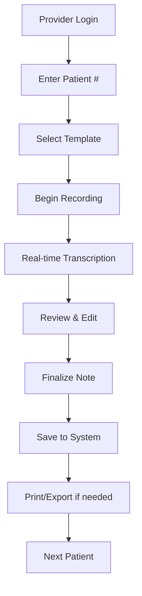
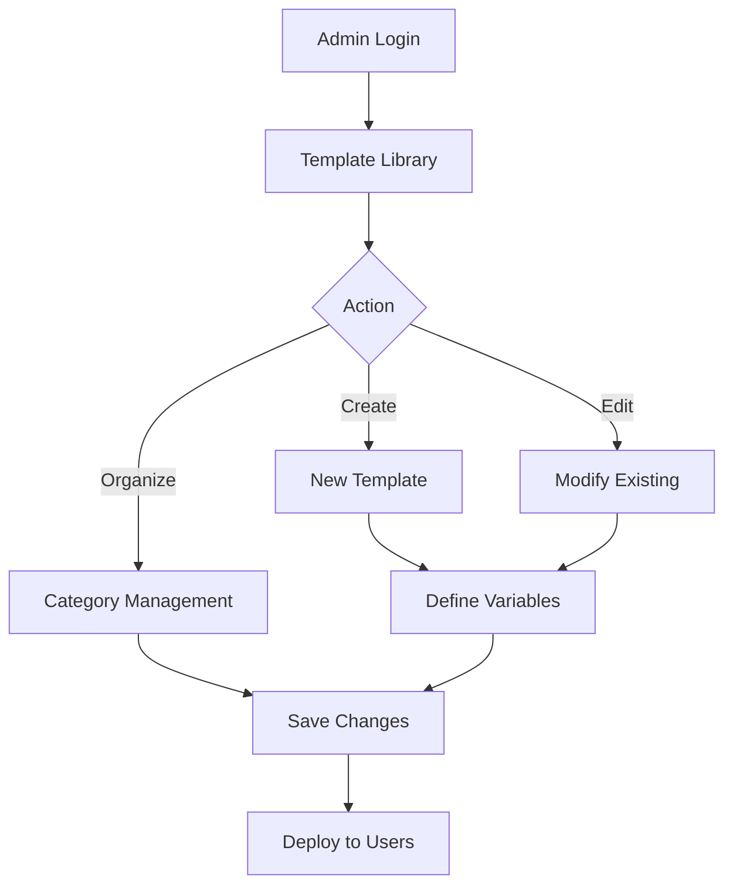

# Verse 1: Business Requirements

> **AI Development Manual → Project Overview → Project Vision → Business Requirements**  
> *Functional requirements and business objectives for the Medical Dictation Service*

---

## 📍 Navigation Context

**Current Location**: `Documentation/AI-Development-Guide/01-Project-Overview/01-Project-Vision/business-requirements.md`  
**Parent**: [Project Vision](README.md)  
**Purpose**: Define core business functionality and user requirements

---

## 🎯 Core Business Objectives

### **Primary Objective**
Reduce healthcare provider documentation time by 50% while maintaining clinical accuracy and HIPAA compliance.

### **Secondary Objectives**
1. **Improve Provider Satisfaction**: Reduce administrative burden and burnout
2. **Enhance Patient Care**: Increase face-to-face interaction time during visits
3. **Ensure Compliance**: Maintain HIPAA standards from day one
4. **Scale Efficiently**: Support practice growth without proportional admin overhead

---

## 📋 Functional Requirements

### **FR-001: Patient Workflow Management**
**Description**: System must support a patient-centric workflow preventing data mix-ups  
**Priority**: Critical  
**Details**:
- Patient number entry at session start
- Automatic patient context maintenance throughout session
- Clear session boundaries preventing cross-patient contamination
- Session finalization before proceeding to next patient

**Acceptance Criteria**:
- [ ] User enters patient # to start new session
- [ ] All transcriptions automatically tagged with current patient
- [ ] System prevents starting new patient without finalizing current
- [ ] Clear visual indicators of current patient context

### **FR-002: Real-time Voice Transcription**
**Description**: System must provide real-time speech-to-text conversion  
**Priority**: Critical  
**Details**:
- Live transcription display during dictation
- Medical terminology optimization
- Pause/resume functionality
- Audio quality indicators

**Acceptance Criteria**:
- [ ] Transcription appears within 2 seconds of speech
- [ ] 90%+ accuracy for medical terminology
- [ ] Visual feedback for audio quality
- [ ] Seamless pause/resume without data loss

### **FR-003: Template Management System**
**Description**: System must support customizable templates for different visit types  
**Priority**: High  
**Details**:
- 20-40 predefined medical templates
- Template categorization and organization
- Variable replacement system
- Custom template creation
- Template sharing across providers

**Acceptance Criteria**:
- [ ] Template library with categorized organization
- [ ] Variable placeholders automatically populated
- [ ] Custom template creation interface
- [ ] Template import/export functionality

### **FR-004: SOAP Note Generation**
**Description**: System must automatically structure transcriptions into SOAP format  
**Priority**: High  
**Details**:
- Automatic SOAP section detection
- Template-driven structure
- Variable substitution
- Review and edit capabilities

**Acceptance Criteria**:
- [ ] Automatic categorization into Subjective/Objective/Assessment/Plan
- [ ] Template variables properly substituted
- [ ] Generated notes are clinically complete
- [ ] Easy editing interface for corrections

### **FR-005: Audio Processing Controls**
**Description**: System must provide intuitive audio recording controls  
**Priority**: High  
**Details**:
- Large, accessible record button
- Visual recording indicators
- Pause/resume functionality
- Audio playback capabilities
- Multiple audio input device support

**Acceptance Criteria**:
- [ ] One-click recording start/stop
- [ ] Clear visual recording status
- [ ] Ability to review recorded audio
- [ ] Support for USB microphones and headsets

---

## 🏥 User Story Requirements

### **US-001: As a Primary Care Physician**
*"I want to dictate during patient visits so that I can maintain eye contact while documenting the encounter."*

**Requirements**:
- Hands-free operation
- Real-time transcription feedback
- Template selection for visit types
- Quick error correction

### **US-002: As a Specialist**
*"I want specialized templates for my procedures so that my notes are consistent and complete."*

**Requirements**:
- Specialty-specific templates
- Custom variable fields
- Template modification capabilities
- Procedure-specific workflows

### **US-003: As a Practice Administrator**
*"I want to ensure all documentation meets compliance standards so that our practice avoids audit issues."*

**Requirements**:
- Audit trail logging
- User access controls
- Data encryption
- Compliance reporting

### **US-004: As a Medical Assistant**
*"I want to help providers with their documentation so that visits stay on schedule."*

**Requirements**:
- Template preparation
- Patient context setup
- Note review assistance
- Workflow coordination

---

## 📊 Business Process Requirements

### **BP-001: Patient Visit Workflow**

### **BP-002: Template Management Workflow**

---

## 💼 Business Rules

### **BR-001: Patient Data Integrity**
- Each dictation session MUST be associated with exactly one patient
- Patient context MUST NOT change during an active session
- Session finalization MUST occur before starting new patient

### **BR-002: Template Consistency**
- All templates MUST include required SOAP sections
- Variable names MUST be consistent across similar templates
- Templates MUST be validated before deployment

### **BR-003: Data Retention**
- Audio recordings MUST be automatically deleted after transcription
- Text transcriptions MUST be retained per practice policy
- Audit logs MUST be maintained for compliance periods

### **BR-004: User Access**
- Users MUST authenticate before accessing patient data
- User permissions MUST align with job responsibilities
- Session timeouts MUST occur after inactivity periods

---

## 🔗 Cross-References

| **Related Requirement** | **Reference** | **Context** |
|-------------------------|---------------|-------------|
| Technical Performance | [Vision:Technical:Requirements](technical-requirements.md) | System specifications |
| HIPAA Compliance | [Vision:HIPAA:Scope](hipaa-scope.md) | Security requirements |
| Success Metrics | [Vision:Success:Criteria](success-criteria.md) | Measurement criteria |
| System Architecture | [Architecture:System:Overview](../../02-Architecture-Design/01-System-Architecture/) | Technical design |

---

## ✅ Requirements Validation Checklist

### **Business Value Validation**
- [ ] Requirements directly address provider time savings
- [ ] Features support clinical workflow integration
- [ ] Compliance requirements are comprehensive
- [ ] Scalability needs are addressed

### **User Experience Validation**
- [ ] Workflows match provider expectations
- [ ] Interface requirements support efficiency
- [ ] Error handling is user-friendly
- [ ] Training requirements are minimal

### **Technical Feasibility Validation**
- [ ] Requirements can be implemented with chosen tech stack
- [ ] Performance expectations are realistic
- [ ] Integration points are clearly defined
- [ ] Security requirements are achievable

---

**Next Steps**: 
- **Technical details?** → See [Technical Requirements](technical-requirements.md)
- **Compliance focus?** → Review [HIPAA Scope](hipaa-scope.md)
- **Implementation planning?** → Go to [Architecture Design](../../02-Architecture-Design/)

---

> **Business Requirements Principle**: *"Every requirement must directly contribute to reducing provider administrative burden while maintaining the highest standards of patient care and data security."* 