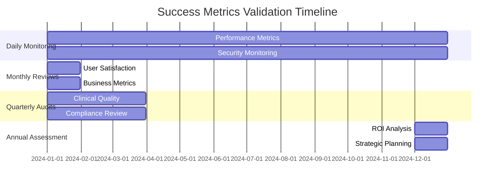

# Verse 4: Success Criteria

> **AI Development Manual → Project Overview → Project Vision → Success Criteria**  
> *Measurable goals and validation criteria for the Medical Dictation Service*

---

## 📍 Navigation Context

**Current Location**: `Documentation/AI-Development-Guide/01-Project-Overview/01-Project-Vision/success-criteria.md`  
**Parent**: [Project Vision](README.md)  
**Purpose**: Define measurable success metrics and validation methods

---

## 🎯 Primary Success Metrics

### **SM-001: Time Savings Achievement**
**Target**: 50% reduction in documentation time compared to traditional typing methods  
**Measurement Method**:
- Baseline measurement of current documentation time per patient
- Post-implementation time tracking with the dictation system
- Comparative analysis across different provider types and visit types

**Success Criteria**:
- [ ] Average documentation time reduced from 8 minutes to 4 minutes per patient
- [ ] 90% of providers report time savings within first month
- [ ] Consistent time savings maintained over 6-month period
- [ ] ROI positive within 12 months of implementation

### **SM-002: Transcription Accuracy**
**Target**: 90%+ accuracy for medical terminology and clinical content  
**Measurement Method**:
- Word Error Rate (WER) calculation for medical terms
- Clinical accuracy review by healthcare professionals
- Comparison with manual transcription gold standards
- Regular accuracy audits with statistical sampling

**Success Criteria**:
- [ ] Medical terminology WER < 10%
- [ ] Clinical content accuracy > 95%
- [ ] Proper noun recognition (medications, procedures) > 85%
- [ ] Accuracy improvement over time through ML model training

### **SM-003: User Adoption Rate**
**Target**: 80% active usage rate within 6 months of deployment  
**Measurement Method**:
- Daily/weekly active user tracking
- Feature utilization analytics
- User engagement metrics and session duration
- Retention rate analysis over time

**Success Criteria**:
- [ ] 50% adoption within first month
- [ ] 80% adoption within 6 months
- [ ] Average 4+ sessions per user per week
- [ ] Monthly retention rate > 90%

### **SM-004: HIPAA Compliance Maintenance**
**Target**: Zero compliance violations and successful audit completion  
**Measurement Method**:
- Regular compliance audits by certified third parties
- Automated compliance monitoring and reporting
- Incident tracking and resolution metrics
- Staff training completion rates

**Success Criteria**:
- [ ] Zero HIPAA violations reported
- [ ] 100% pass rate on quarterly compliance audits
- [ ] < 24-hour incident response time
- [ ] 100% staff training completion

---

## 📊 Performance Metrics

### **PM-001: System Performance**
**Targets and Measurements**:

| **Metric** | **Target** | **Measurement Method** | **Frequency** |
|------------|------------|------------------------|---------------|
| Response Time | < 200ms | Application Performance Monitoring | Real-time |
| Transcription Latency | < 2 seconds | Speech service metrics | Real-time |
| System Uptime | 99.9% | Infrastructure monitoring | Monthly |
| Concurrent Users | 50+ supported | Load testing | Quarterly |

**Success Criteria**:
- [ ] All response times consistently meet targets
- [ ] Zero unplanned downtime > 1 hour
- [ ] Successful load testing at 2x expected capacity
- [ ] Performance degradation < 5% under peak load

### **PM-002: Audio Quality & Processing**
**Targets and Measurements**:

| **Metric** | **Target** | **Measurement Method** | **Frequency** |
|------------|------------|------------------------|---------------|
| Audio Recognition Quality | SNR > 20dB | Audio processing analytics | Per session |
| Background Noise Handling | < 5% accuracy degradation | Controlled testing | Monthly |
| Multiple Speaker Support | 85% accuracy | Multi-speaker scenarios | Quarterly |
| Audio Device Compatibility | 95% plug-and-play success | Device testing matrix | Release cycle |

---

## 🏥 Clinical Outcome Metrics

### **CO-001: Documentation Quality**
**Target**: Improved clinical documentation completeness and consistency  
**Measurement Method**:
- Clinical documentation audit by healthcare quality experts
- Template completion rate analysis
- SOAP note structure compliance review
- Peer review feedback collection

**Success Criteria**:
- [ ] 95% template completion rate
- [ ] 90% SOAP note structure compliance
- [ ] Reduced documentation variation between providers
- [ ] Improved clinical content quality scores

### **CO-002: Provider Satisfaction**
**Target**: > 4.0/5.0 satisfaction rating from healthcare providers  
**Measurement Method**:
- Monthly provider satisfaction surveys
- Feature-specific feedback collection
- User experience interviews and focus groups
- Net Promoter Score (NPS) tracking

**Success Criteria**:
- [ ] Overall satisfaction > 4.0/5.0
- [ ] NPS score > 50
- [ ] 90% would recommend to colleagues
- [ ] < 10% request to return to previous documentation method

### **CO-003: Patient Care Impact**
**Target**: Increased patient-provider interaction time during visits  
**Measurement Method**:
- Visit duration analysis with time allocation tracking
- Patient satisfaction surveys regarding provider attention
- Provider feedback on patient interaction quality
- Comparison studies with control groups

**Success Criteria**:
- [ ] 25% increase in direct patient interaction time
- [ ] Improved patient satisfaction scores related to provider attention
- [ ] Provider reports of better patient engagement
- [ ] Reduced patient wait times due to faster documentation

---

## 💰 Business Success Metrics

### **BS-001: Return on Investment (ROI)**
**Target**: Positive ROI within 12 months of implementation  
**Calculation Method**:
```
ROI = (Time Savings Value - Implementation Costs) / Implementation Costs × 100
```

**Time Savings Value Calculation**:
- Average provider hourly rate × Hours saved per day × Working days per year
- Reduced overtime costs due to documentation efficiency
- Increased patient throughput revenue potential

**Success Criteria**:
- [ ] Break-even point reached within 9 months
- [ ] 200%+ ROI within 24 months
- [ ] Cost per provider per month < $200
- [ ] Demonstrable revenue increase through efficiency gains

### **BS-002: Operational Efficiency**
**Target**: Improved practice operational metrics  
**Measurement Method**:
- Patient throughput analysis
- Documentation backlog tracking
- Provider overtime hours reduction
- Administrative staff burden measurement

**Success Criteria**:
- [ ] 15% increase in daily patient capacity
- [ ] 50% reduction in documentation backlog
- [ ] 25% reduction in provider overtime hours
- [ ] Positive impact on practice scheduling efficiency

---

## 🔒 Security & Compliance Metrics

### **SC-001: Security Posture**
**Target**: Maintain robust security with zero breaches  
**Measurement Method**:
- Security incident tracking and analysis
- Vulnerability assessment results
- Penetration testing outcomes
- Security audit findings

**Success Criteria**:
- [ ] Zero security breaches or data exposures
- [ ] 100% critical vulnerability remediation within 48 hours
- [ ] Successful annual penetration testing
- [ ] Clean security audit reports

### **SC-002: Data Protection**
**Target**: Complete data protection with audit trail integrity  
**Measurement Method**:
- Audit log completeness verification
- Data encryption validation testing
- Access control effectiveness reviews
- Backup and recovery testing results

**Success Criteria**:
- [ ] 100% audit trail coverage for all ePHI access
- [ ] 100% data encryption compliance
- [ ] Successful quarterly backup recovery tests
- [ ] Zero unauthorized data access incidents

---

## 📈 Continuous Improvement Metrics

### **CI-001: Feature Evolution**
**Target**: Continuous enhancement based on user feedback  
**Measurement Method**:
- Feature request tracking and implementation rate
- User feedback sentiment analysis
- A/B testing results for new features
- Innovation metric tracking

**Success Criteria**:
- [ ] Monthly feature releases based on user feedback
- [ ] 80% positive sentiment on new feature releases
- [ ] Successful A/B testing validation for major features
- [ ] Continuous improvement in user experience metrics

### **CI-002: Technology Advancement**
**Target**: Leverage advancing AI/ML capabilities for improved performance  
**Measurement Method**:
- ML model performance improvement tracking
- Speech recognition accuracy trend analysis
- Technology adoption and integration success
- Competitive analysis and benchmarking

**Success Criteria**:
- [ ] Quarterly accuracy improvements through ML model updates
- [ ] Successful integration of new speech recognition technologies
- [ ] Maintained competitive advantage in medical dictation accuracy
- [ ] Proactive adoption of beneficial healthcare technology standards

---

## 📋 Validation Methods & Tools

### **Automated Monitoring**
- **Application Performance Monitoring (APM)**: Real-time performance tracking
- **User Analytics**: Comprehensive user behavior and engagement tracking
- **System Health Monitoring**: Infrastructure and service availability tracking
- **Security Monitoring**: Continuous security posture assessment

### **Regular Assessments**
- **Monthly Business Reviews**: KPI tracking and trend analysis
- **Quarterly Clinical Audits**: Healthcare quality and compliance reviews
- **Semi-Annual User Research**: In-depth user experience studies
- **Annual Strategic Assessment**: Overall project success evaluation and planning

### **Validation Schedule**


---

## 🔗 Cross-References

| **Success Area** | **Reference** | **Context** |
|------------------|---------------|-------------|
| Business Requirements | [Vision:Business:Requirements](business-requirements.md) | Functional goal alignment |
| Technical Specifications | [Vision:Technical:Requirements](technical-requirements.md) | Performance target validation |
| HIPAA Compliance | [Vision:HIPAA:Scope](hipaa-scope.md) | Compliance success criteria |
| Implementation Planning | [Implementation:Phases:Overview](../../03-Implementation-Phases/) | Milestone tracking |

---

**Next Steps**: 
- **Technical planning?** → See [Technology Research](../02-Technology-Research/)
- **Architecture details?** → Go to [System Architecture](../../02-Architecture-Design/01-System-Architecture/)
- **Implementation planning?** → Review [Implementation Phases](../../03-Implementation-Phases/)

---

> **Success Criteria Principle**: *"Success is not just about building the system - it's about measurably improving the lives of healthcare providers and the quality of patient care."* 