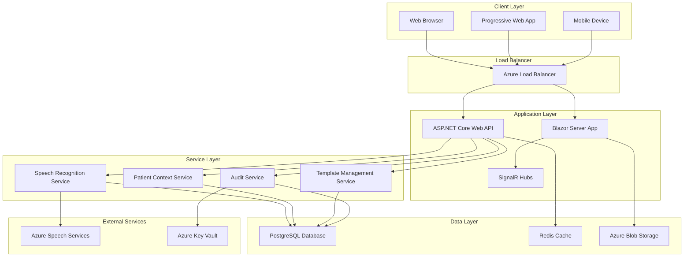
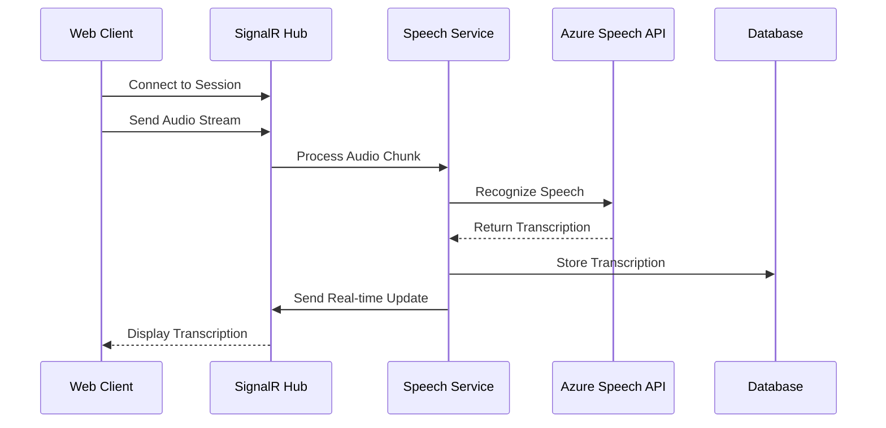
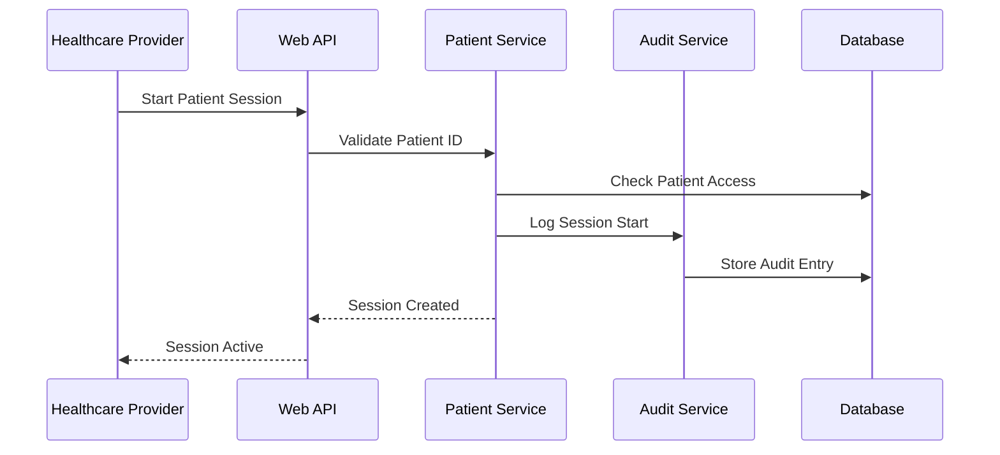

# Book 2: Architecture Design

> **AI Development Manual → Architecture Design**  
> *System architecture, security design, and technical specifications for the Medical Dictation Service*

---

## 📍 Navigation Context

**Current Location**: `Documentation/AI-Development-Guide/02-Architecture-Design/`  
**Parent**: [AI Development Guide](../README.md)  
**Purpose**: Define system architecture and technical design patterns

---

## 📖 Chapters in This Book

### **Chapter 1: System Architecture Overview** [`01-System-Architecture/`](01-System-Architecture/)
- **Verse 1**: [High-Level Architecture](01-System-Architecture/high-level-architecture.md)
- **Verse 2**: [Component Interactions](01-System-Architecture/component-interactions.md)
- **Verse 3**: [Data Flow Patterns](01-System-Architecture/data-flow-patterns.md)
- **Verse 4**: [Scalability Design](01-System-Architecture/scalability-design.md)

### **Chapter 2: Security & HIPAA Compliance** [`02-Security-Compliance/`](02-Security-Compliance/)
- **Verse 1**: [Security Architecture](02-Security-Compliance/security-architecture.md)
- **Verse 2**: [Authentication & Authorization](02-Security-Compliance/auth-design.md)
- **Verse 3**: [Data Encryption & Privacy](02-Security-Compliance/encryption-design.md)
- **Verse 4**: [Audit & Monitoring](02-Security-Compliance/audit-design.md)

### **Chapter 3: Data Models & Database Design** [`03-Data-Models/`](03-Data-Models/)
- **Verse 1**: [Entity Relationship Design](03-Data-Models/entity-design.md)
- **Verse 2**: [Database Schema](03-Data-Models/database-schema.md)
- **Verse 3**: [Data Access Patterns](03-Data-Models/data-access-patterns.md)
- **Verse 4**: [Migration Strategies](03-Data-Models/migration-strategies.md)

### **Chapter 4: API Design & Patterns** [`04-API-Design/`](04-API-Design/)
- **Verse 1**: [RESTful API Design](04-API-Design/rest-api-design.md)
- **Verse 2**: [Real-time Communication](04-API-Design/realtime-design.md)
- **Verse 3**: [Error Handling Patterns](04-API-Design/error-handling.md)
- **Verse 4**: [API Security & Versioning](04-API-Design/api-security.md)

---

## 🏗️ Architecture Overview

### **System Architecture Principles**
Our medical dictation service follows these core architectural principles:

1. **Security by Design**: HIPAA compliance built into every component
2. **Real-time First**: Optimized for live transcription and immediate feedback
3. **Scalable Foundation**: Designed to grow from prototype to production
4. **Medical Domain Focus**: Architecture tailored for healthcare workflows
5. **Fault Tolerance**: Graceful handling of component failures
6. **Audit Everything**: Comprehensive logging for compliance and debugging

### **High-Level Architecture Diagram**

---

## 🔄 Component Interactions

### **Real-time Transcription Flow**

### **Patient Session Management**

---

## 🎯 Architecture Decisions

### **Technology Stack Rationale**

| **Component** | **Technology** | **Architectural Rationale** |
|---------------|----------------|------------------------------|
| **Frontend** | Blazor Server | Real-time UI updates, C# consistency, reduced complexity |
| **Backend** | ASP.NET Core 8 | Strong security features, Azure integration, performance |
| **Database** | PostgreSQL | JSON support for templates, HIPAA compliance, cost-effective |
| **Real-time** | SignalR | Native integration, WebSocket fallback, group management |
| **Speech** | Azure Speech Services | Medical terminology, HIPAA BAA, reliability |
| **Caching** | Redis | Session management, performance optimization |
| **Storage** | Azure Blob Storage | Secure file storage, HIPAA compliant |

### **Architectural Patterns**

#### **1. Clean Architecture**
- **Domain Layer**: Core business logic and entities
- **Application Layer**: Use cases and business workflows
- **Infrastructure Layer**: External services and data access
- **Presentation Layer**: Blazor components and API controllers

#### **2. CQRS (Command Query Responsibility Segregation)**
- **Commands**: Write operations (create transcriptions, manage templates)
- **Queries**: Read operations (retrieve patient data, search templates)
- **Separation**: Optimized read and write operations

#### **3. Event-Driven Architecture**
- **Domain Events**: Patient session events, transcription completion
- **Event Handlers**: Audit logging, notifications, data synchronization
- **Event Store**: Audit trail and system monitoring

---

## 🔒 Security Architecture

### **Defense in Depth**
Our security strategy implements multiple layers of protection:

1. **Network Security**: Azure WAF, DDoS protection, network segmentation
2. **Application Security**: Input validation, CSRF protection, secure headers
3. **Authentication**: Multi-factor authentication, certificate-based API access
4. **Authorization**: Role-based access control, fine-grained permissions
5. **Data Protection**: Encryption at rest and in transit, secure key management
6. **Monitoring**: Real-time threat detection, comprehensive audit logging

### **HIPAA Compliance Integration**
- **Administrative Safeguards**: Security officer, workforce training, incident response
- **Physical Safeguards**: Cloud provider SOC 2 compliance, workstation security
- **Technical Safeguards**: Access control, audit controls, integrity controls

---

## 📊 Performance & Scalability

### **Performance Targets**
- **Response Time**: < 200ms for UI interactions
- **Transcription Latency**: < 2 seconds speech-to-text
- **Concurrent Users**: 50+ simultaneous transcription sessions
- **Availability**: 99.9% uptime during business hours

### **Scalability Strategies**
- **Horizontal Scaling**: Multiple app service instances
- **Database Scaling**: Read replicas, connection pooling
- **Caching**: Redis for session data and frequently accessed templates
- **CDN**: Static asset delivery optimization

### **Monitoring & Observability**
- **Application Insights**: Performance monitoring and error tracking
- **Health Checks**: Automated service health monitoring
- **Metrics**: Custom business metrics and KPIs
- **Alerting**: Proactive issue detection and notification

---

## 🔗 Cross-References

| **Architecture Aspect** | **Reference** | **Context** |
|------------------------|---------------|-------------|
| Business Requirements | [Vision:Business:Requirements](../01-Project-Overview/01-Project-Vision/business-requirements.md) | Functional needs |
| Technical Requirements | [Vision:Technical:Requirements](../01-Project-Overview/01-Project-Vision/technical-requirements.md) | Performance specs |
| HIPAA Compliance | [Vision:HIPAA:Scope](../01-Project-Overview/01-Project-Vision/hipaa-scope.md) | Compliance requirements |
| Implementation Planning | [Implementation:Phases:Overview](../03-Implementation-Phases/) | Development roadmap |

---

## 📋 Architecture Validation Checklist

### **Design Validation**
- [ ] Architecture supports all business requirements
- [ ] HIPAA compliance integrated into all components
- [ ] Performance targets achievable with proposed design
- [ ] Scalability strategy addresses growth projections
- [ ] Security architecture provides defense in depth

### **Technical Validation**
- [ ] Component interfaces clearly defined
- [ ] Data flow patterns optimize for performance
- [ ] Error handling strategies cover all failure modes
- [ ] Monitoring and observability provide adequate visibility
- [ ] Deployment architecture supports operational needs

---

**Next Steps**: 
- **Detailed architecture?** → See [System Architecture Overview](01-System-Architecture/)
- **Security design?** → Review [Security & HIPAA Compliance](02-Security-Compliance/)
- **Data modeling?** → Go to [Data Models & Database Design](03-Data-Models/)
- **API planning?** → See [API Design & Patterns](04-API-Design/)

---

> **Architecture Design Principle**: *"Build an architecture that not only supports current medical transcription needs but provides a foundation for future healthcare innovation while maintaining unwavering security and compliance standards."* 