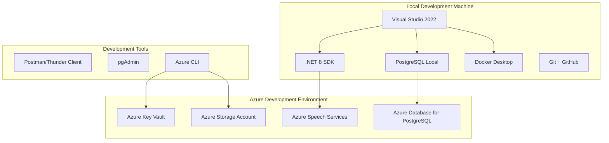

# Chapter 1: Development Environment Setup

> **AI Development Manual → Implementation Phases → Development Environment Setup**  
> *Setting up the complete development environment for the Medical Dictation Service*

---

## 📍 Navigation Context

**Current Location**: `Documentation/AI-Development-Guide/03-Implementation-Phases/01-Development-Environment/`  
**Parent**: [Implementation Phases](../README.md)  
**Target Version**: `0.1-01`  
**Purpose**: Complete development environment configuration

---

## 📖 Verses in This Chapter

### **Verse 1**: [Local Development Setup](local-setup.md)
Complete local machine configuration with .NET 8, databases, and tools

### **Verse 2**: [Azure Services Configuration](azure-setup.md)  
Azure account setup, Speech Services, and Key Vault configuration

### **Verse 3**: [Database Setup](database-setup.md)
PostgreSQL installation, configuration, and initial schema

### **Verse 4**: [Development Tools & IDE](tools-setup.md)
Visual Studio/VS Code setup, extensions, and productivity tools

---

## 🎯 Environment Setup Overview

### **Development Environment Goals**
- ✅ **Complete Local Development**: Full functionality without internet dependency
- ✅ **Azure Integration Ready**: Seamless cloud service integration
- ✅ **HIPAA Compliant**: Security configurations from day one
- ✅ **Team Consistency**: Standardized development environment across team
- ✅ **Productivity Optimized**: Tools and configurations for efficient development

### **Environment Architecture**


---

## ⚡ Quick Start Guide

### **Prerequisites Checklist**
Before beginning setup, ensure you have:
- [ ] **Admin rights** on your development machine
- [ ] **Azure subscription** with billing enabled
- [ ] **Git installed** and configured
- [ ] **GitHub account** set up
- [ ] **Stable internet connection** for downloads and Azure setup

### **Setup Time Estimate**
- **Local Environment**: 2-3 hours
- **Azure Configuration**: 1-2 hours  
- **Database Setup**: 30-60 minutes
- **Tools & Extensions**: 30-60 minutes
- **Total**: 4-7 hours for complete setup

---

## 🔧 Core Components Installation Order

### **Phase 1: Foundation (30 minutes)**
1. **.NET 8 SDK** - Core development framework
2. **Git & GitHub CLI** - Version control
3. **Visual Studio 2022 Community/Professional** - Primary IDE

### **Phase 2: Database & Storage (45 minutes)**
1. **PostgreSQL 15+** - Local development database
2. **pgAdmin** - Database management tool
3. **Docker Desktop** - Container support (optional)

### **Phase 3: Azure Integration (60 minutes)**
1. **Azure CLI** - Cloud service management
2. **Azure Speech Services** - Create and configure
3. **Azure Key Vault** - Secure secrets management
4. **Azure Storage Account** - File storage for development

### **Phase 4: Development Tools (30 minutes)**
1. **Thunder Client/Postman** - API testing
2. **VS Code Extensions** - Enhanced development experience
3. **Git Extensions** - Advanced Git functionality

---

## 🔒 Security Configuration

### **Development Security Standards**
From the start, our development environment must follow security best practices:

#### **Local Security**
- [ ] **Encrypted storage** for development machine
- [ ] **Strong passwords** for all accounts and services
- [ ] **Two-factor authentication** enabled for GitHub and Azure
- [ ] **Local firewall** properly configured

#### **Azure Security**
- [ ] **Azure Key Vault** for all secrets and connection strings
- [ ] **Managed Identity** where possible
- [ ] **Network security groups** configured for development resources
- [ ] **Azure AD authentication** for service access

#### **Code Security**
- [ ] **Pre-commit hooks** for security scanning
- [ ] **Secrets scanning** enabled in repository
- [ ] **Dependency vulnerability scanning** configured
- [ ] **HTTPS only** for all local development endpoints

---

## 📋 Environment Validation Checklist

### **Local Development Validation**
After setup completion, verify these capabilities:

#### **.NET 8 Development**
- [ ] `dotnet --version` returns 8.0.x
- [ ] Can create new Blazor Server project
- [ ] Can restore NuGet packages
- [ ] Can build and run sample project

#### **Database Connectivity**
- [ ] PostgreSQL service running
- [ ] Can connect via pgAdmin
- [ ] Can create test database
- [ ] Entity Framework migrations work

#### **Azure Integration**
- [ ] Azure CLI authenticated (`az account show`)
- [ ] Can access Speech Services
- [ ] Can read/write to Key Vault
- [ ] Storage account accessible

### **Development Workflow Validation**
Test the complete development workflow:

1. **Create New Feature Branch**
   ```bash
   git checkout -b feature/v0.1-01-validation
   ```

2. **Create Test Blazor Project**
   ```bash
   dotnet new blazorserver -n TestMedicalApp
   cd TestMedicalApp
   dotnet add package Microsoft.CognitiveServices.Speech
   ```

3. **Test Azure Speech Integration**
   ```csharp
   // Basic speech recognition test
   var config = SpeechConfig.FromSubscription(key, region);
   using var recognizer = new SpeechRecognizer(config);
   var result = await recognizer.RecognizeOnceAsync();
   ```

4. **Test Database Connection**
   ```csharp
   // Entity Framework connection test
   var connectionString = "your-postgresql-connection";
   services.AddDbContext<TestContext>(options =>
       options.UseNpgsql(connectionString));
   ```

---

## 🛠️ Troubleshooting Common Issues

### **Common Setup Problems**

| **Issue** | **Symptoms** | **Solution** |
|-----------|--------------|--------------|
| .NET SDK Issues | Build errors, missing templates | Reinstall SDK, clear NuGet cache |
| PostgreSQL Connection | Connection refused errors | Check service status, firewall settings |
| Azure CLI Auth | "Not logged in" errors | Run `az login`, check subscription |
| Speech Services | Authentication failures | Verify keys, check service region |
| Git Issues | Push/pull failures | Check SSH keys, repository permissions |

### **Development Environment Health Check**
Run this validation script to verify environment health:

```bash
# Environment Health Check Script
echo "=== Development Environment Health Check ==="
echo "1. .NET SDK Version:"
dotnet --version

echo "2. Git Configuration:"
git --version
git config user.name
git config user.email

echo "3. Azure CLI Status:"
az account show --query "name" -o tsv

echo "4. PostgreSQL Status:"
pg_isready

echo "5. Docker Status (if installed):"
docker --version

echo "=== Health Check Complete ==="
```

---

## 📚 Development Resources

### **Essential Documentation**
- [ASP.NET Core Documentation](https://docs.microsoft.com/en-us/aspnet/core/)
- [Azure Speech Services SDK](https://docs.microsoft.com/en-us/azure/cognitive-services/speech-service/)
- [PostgreSQL Documentation](https://www.postgresql.org/docs/)
- [Entity Framework Core Guide](https://docs.microsoft.com/en-us/ef/core/)

### **Development Tools Documentation**
- [Visual Studio 2022 Features](https://docs.microsoft.com/en-us/visualstudio/)
- [Azure CLI Reference](https://docs.microsoft.com/en-us/cli/azure/)
- [Git Best Practices](https://git-scm.com/doc)

---

## 🔗 Cross-References

| **Setup Component** | **Reference** | **Context** |
|--------------------|---------------|-------------|
| Technology Stack Details | [Research:Technology:Overview](../../01-Project-Overview/02-Technology-Research/) | Technology choices |
| Security Requirements | [Vision:HIPAA:Scope](../../01-Project-Overview/01-Project-Vision/hipaa-scope.md) | Compliance setup |
| Architecture Overview | [Architecture:System:Overview](../../02-Architecture-Design/01-System-Architecture/) | System design |
| Next Implementation Phase | [Implementation:Phase1:Core](../02-Phase-1-Core/) | After environment setup |

---

## 🎯 Success Criteria for Version 0.1-01

### **Environment Setup Completion**
Mark version `0.1-01` complete when:
- [ ] All local development tools installed and working
- [ ] Azure services configured and accessible
- [ ] Database connectivity established
- [ ] Security configurations in place
- [ ] Development workflow validated
- [ ] Team environment standardized
- [ ] Documentation updated with environment specifics

### **Ready for Next Phase**
Environment setup enables:
- ✅ **Project Creation**: Can create new ASP.NET Core projects
- ✅ **Azure Integration**: Speech Services and Key Vault accessible
- ✅ **Database Development**: PostgreSQL ready for schema creation
- ✅ **Security Development**: Foundation for HIPAA compliance
- ✅ **Team Collaboration**: Standardized development environment

---

**Next Steps**: 
- **Complete local setup?** → See [Local Development Setup](local-setup.md)
- **Configure Azure?** → Review [Azure Services Configuration](azure-setup.md)
- **After environment setup?** → Proceed to [Phase 1 Core Implementation](../02-Phase-1-Core/)

---

> **Development Environment Principle**: *"A well-configured development environment is the foundation for secure, efficient, and collaborative medical software development."* 