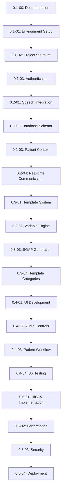

# Book 3: Implementation Phases

> **AI Development Manual → Implementation Phases**  
> *Step-by-step development workflow for the Medical Dictation Service*

---

## 📍 Navigation Context

**Current Location**: `Documentation/AI-Development-Guide/03-Implementation-Phases/`  
**Parent**: [AI Development Guide](../README.md)  
**Purpose**: Define development phases aligned with version roadmap

---

## 📖 Chapters in This Book

### **Chapter 1: Development Environment Setup** [`01-Development-Environment/`](01-Development-Environment/)
**Target Version**: `0.1-01`  
- **Verse 1**: [Local Development Setup](01-Development-Environment/local-setup.md)
- **Verse 2**: [Azure Services Configuration](01-Development-Environment/azure-setup.md)
- **Verse 3**: [Database Setup](01-Development-Environment/database-setup.md)
- **Verse 4**: [Development Tools & IDE](01-Development-Environment/tools-setup.md)

### **Chapter 2: Phase 1 - Core Infrastructure** [`02-Phase-1-Core/`](02-Phase-1-Core/)
**Target Versions**: `0.1-02` to `0.2-04`  
- **Verse 1**: [Project Structure Creation](02-Phase-1-Core/project-structure.md)
- **Verse 2**: [Authentication Implementation](02-Phase-1-Core/authentication.md)
- **Verse 3**: [Database Schema & Models](02-Phase-1-Core/database-models.md)
- **Verse 4**: [Speech Services Integration](02-Phase-1-Core/speech-integration.md)

### **Chapter 3: Phase 2 - Template Intelligence** [`03-Phase-2-Templates/`](03-Phase-2-Templates/)
**Target Versions**: `0.3-01` to `0.3-04`  
- **Verse 1**: [Template Management System](03-Phase-2-Templates/template-system.md)
- **Verse 2**: [Variable Replacement Engine](03-Phase-2-Templates/variable-engine.md)
- **Verse 3**: [SOAP Note Generation](03-Phase-2-Templates/soap-generation.md)
- **Verse 4**: [Template Categories](03-Phase-2-Templates/template-categories.md)

### **Chapter 4: Phase 3 - User Experience** [`04-Phase-3-UX/`](04-Phase-3-UX/)
**Target Versions**: `0.4-01` to `0.4-04`  
- **Verse 1**: [Live Transcription Interface](04-Phase-3-UX/transcription-ui.md)
- **Verse 2**: [Audio Controls](04-Phase-3-UX/audio-controls.md)
- **Verse 3**: [Patient Workflow UI](04-Phase-3-UX/patient-workflow.md)
- **Verse 4**: [User Experience Testing](04-Phase-3-UX/ux-testing.md)

### **Chapter 5: Phase 4 - Production Readiness** [`05-Phase-4-Advanced/`](05-Phase-4-Advanced/)
**Target Versions**: `0.5-01` to `0.5-04`  
- **Verse 1**: [HIPAA Compliance Implementation](05-Phase-4-Advanced/hipaa-implementation.md)
- **Verse 2**: [Performance Optimization](05-Phase-4-Advanced/performance.md)
- **Verse 3**: [Security Hardening](05-Phase-4-Advanced/security-hardening.md)
- **Verse 4**: [Deployment Pipeline](05-Phase-4-Advanced/deployment.md)

---

## 🎯 Implementation Strategy

### **Phase-Based Development Approach**
Our implementation follows a structured approach where each phase builds upon the previous:

### **Development Principles**
1. **Security First**: Every feature implemented with HIPAA compliance in mind
2. **Test-Driven**: Comprehensive testing at each phase
3. **Documentation Driven**: Update docs before and after each implementation
4. **Iterative Feedback**: Regular validation against success criteria
5. **Version Controlled**: Clear version progression with documented changes

---

## 📋 Phase Completion Criteria

### **Phase Validation Framework**
Each phase must meet these criteria before progression:

#### **✅ Functional Validation**
- All planned features for the phase are implemented and working
- Integration tests pass for new components
- No critical bugs or security vulnerabilities
- Performance meets phase-specific targets

#### **📝 Documentation Validation**
- Architecture documentation updated for new components
- Implementation patterns documented with examples
- Cross-references updated and validated
- Version number incremented and roadmap updated

#### **🔒 Security Validation**
- Security review completed for new features
- HIPAA compliance assessed and documented
- Audit logging implemented for new data access
- Encryption verified for sensitive data

#### **🧪 Quality Validation**
- Code review completed by team members
- Unit tests written and passing (>80% coverage)
- Integration tests validate component interactions
- User acceptance testing (where applicable)

---

## 🔄 Version Progression Workflow

### **Standard Phase Completion Process**

1. **Pre-Implementation Review**
   - [ ] Review current documentation for planned changes
   - [ ] Update architecture docs if needed
   - [ ] Verify phase prerequisites are met
   - [ ] Create implementation branch (feature/v0.x-xx)

2. **Implementation**
   - [ ] Follow documented patterns and standards
   - [ ] Implement features according to specifications
   - [ ] Write comprehensive tests
   - [ ] Update code documentation

3. **Phase Validation**
   - [ ] Run all tests and ensure they pass
   - [ ] Perform security review
   - [ ] Validate HIPAA compliance requirements
   - [ ] Test integration with existing components

4. **Documentation Update**
   - [ ] Update implementation status in documentation
   - [ ] Document new patterns or architectural decisions
   - [ ] Update cross-references and navigation
   - [ ] Increment version number in main README

5. **Phase Completion**
   - [ ] Merge implementation branch to main
   - [ ] Tag release with version number
   - [ ] Update roadmap progress (✅ completed)
   - [ ] Plan next phase activities

---

## 🛠️ Development Tools & Standards

### **Required Development Environment**
- **.NET 8 SDK**: Latest stable version
- **Visual Studio 2022** or **Visual Studio Code**: With C# extensions
- **PostgreSQL 15+**: Local development database
- **Azure CLI**: For cloud service management
- **Git**: Version control with conventional commits
- **Docker Desktop**: Container development (optional but recommended)

### **Code Quality Standards**
- **Coding Style**: Follow C# coding conventions
- **Documentation**: XML documentation for public APIs
- **Testing**: Minimum 80% code coverage
- **Security**: Static code analysis with security rules
- **Performance**: Benchmarking for critical paths

### **Git Workflow**
- **Branch Naming**: `feature/v0.x-xx-description`
- **Commit Messages**: Conventional commits format
- **Pull Requests**: Required for all changes to main
- **Tags**: Version tags for each phase completion

---

## 📊 Progress Tracking

### **Implementation Metrics**
Track progress using these metrics throughout development:

| **Metric** | **Target** | **Measurement** |
|------------|------------|-----------------|
| Code Coverage | >80% | Automated testing reports |
| Documentation Coverage | 100% | All public APIs documented |
| Security Compliance | 100% | Security checklist completion |
| Performance Targets | Met per phase | Benchmark validation |
| Feature Completeness | 100% per phase | Acceptance criteria validation |

### **Phase Milestone Tracking**
- **Daily**: Update task completion status
- **Weekly**: Review phase progress and blockers
- **Phase End**: Complete validation checklist
- **Version Release**: Update documentation and roadmap

---

## 🔗 Cross-References

| **Implementation Aspect** | **Reference** | **Context** |
|---------------------------|---------------|-------------|
| Project Requirements | [Vision:Business:Requirements](../01-Project-Overview/01-Project-Vision/business-requirements.md) | Feature specifications |
| Technical Specifications | [Vision:Technical:Requirements](../01-Project-Overview/01-Project-Vision/technical-requirements.md) | Performance targets |
| Architecture Design | [Architecture:System:Overview](../02-Architecture-Design/01-System-Architecture/) | System structure |
| Technology Choices | [Research:Technology:Stack](../01-Project-Overview/02-Technology-Research/) | Implementation tools |

---

## 🚨 Critical Implementation Notes

### **For AI Assistants**
- **Always check current version** in main README before starting work
- **Follow phase sequence** - don't skip ahead unless prerequisites are met
- **Update documentation FIRST** before implementing new features
- **Validate security implications** of every change
- **Test integration** with existing components

### **For Human Developers**
- Each phase builds on previous work - maintain backwards compatibility
- Security and HIPAA compliance are non-negotiable requirements
- Performance targets must be met before phase completion
- Documentation is as important as code - keep it current

---

**Next Steps**: 
- **Start development?** → Begin with [Development Environment Setup](01-Development-Environment/)
- **Current phase details?** → Check main README for current version and phase
- **Architecture review?** → See [Architecture Design](../02-Architecture-Design/)

---

> **Implementation Phases Principle**: *"Each phase must deliver working, secure, and well-documented functionality that brings us closer to empowering healthcare providers with efficient, compliant medical dictation capabilities."* 