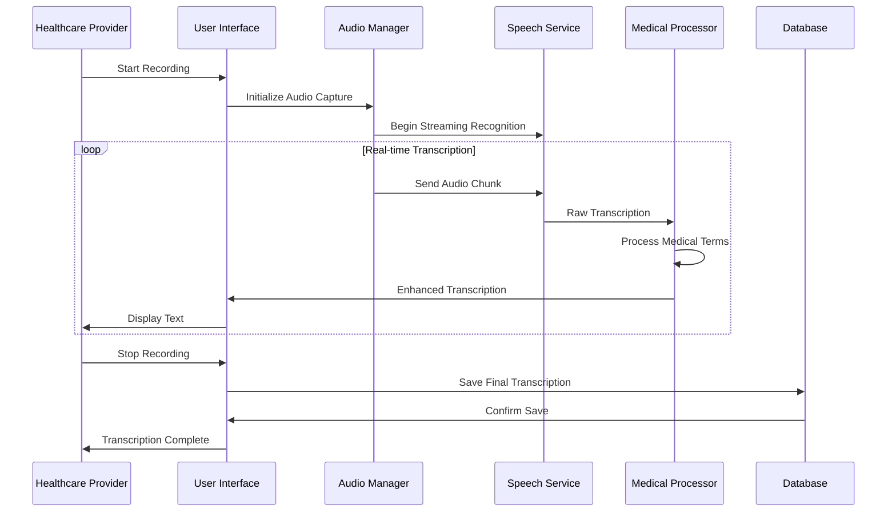

# Chapter 1: Core Transcription Features

> **AI Development Manual → Feature Specifications → Core Transcription Features**  
> *Real-time speech recognition and medical transcription specifications*

---

## 📍 Navigation Context

**Current Location**: `Documentation/AI-Development-Guide/04-Feature-Specifications/01-Core-Transcription/`  
**Parent**: [Feature Specifications](../README.md)  
**Implementation Phases**: `0.2-01` to `0.2-04`  
**Purpose**: Define core speech-to-text and medical transcription functionality

---

## 📖 Verses in This Chapter

### **Verse 1**: [Real-time Speech Recognition](speech-recognition.md)
Azure Speech Services integration, streaming recognition, and real-time processing

### **Verse 2**: [Medical Terminology Processing](medical-terminology.md)  
Medical vocabulary optimization, drug names, procedures, and clinical terms

### **Verse 3**: [Audio Quality Management](audio-quality.md)
Audio input validation, noise reduction, and quality feedback

### **Verse 4**: [Transcription Accuracy Optimization](accuracy-optimization.md)
Confidence scoring, error correction, and continuous improvement

---

## 🎯 Core Transcription Overview

### **Primary Capabilities**
The core transcription system provides:

- ✅ **Real-time Speech-to-Text**: Live transcription during patient encounters
- ✅ **Medical Terminology Recognition**: Optimized for healthcare vocabulary
- ✅ **Multi-speaker Support**: Distinguish between provider and patient speech
- ✅ **Audio Quality Management**: Automatic quality assessment and feedback
- ✅ **Confidence Scoring**: Real-time accuracy indicators
- ✅ **Error Correction Interface**: Quick correction tools for providers

### **Transcription Workflow**


---

## 🔧 Technical Specifications

### **Speech Recognition Requirements**

| **Specification** | **Target** | **Measurement** | **Implementation Priority** |
|------------------|------------|-----------------|---------------------------|
| **Transcription Latency** | <2 seconds | Audio input to text display | 🟢 Critical |
| **Medical Terminology Accuracy** | >90% | WER for medical terms | 🟢 Critical |
| **General Speech Accuracy** | >85% | Overall WER | 🟡 High |
| **Real-time Factor** | <0.5 | Processing time vs. audio length | 🟡 High |
| **Concurrent Sessions** | 50+ | Simultaneous transcription sessions | 🟠 Medium |

### **Audio Processing Requirements**

| **Audio Specification** | **Target** | **Notes** |
|------------------------|------------|-----------|
| **Sample Rate** | 16kHz minimum | Azure Speech Services requirement |
| **Bit Depth** | 16-bit | Standard for speech recognition |
| **Channels** | Mono preferred | Reduces processing overhead |
| **Format Support** | WAV, MP3, PCM | Multiple input format support |
| **Noise Reduction** | Automatic | Background noise filtering |

---

## 🏥 Medical Domain Optimization

### **Medical Vocabulary Categories**

#### **1. Anatomical Terms**
- Body systems and organs
- Anatomical locations and positions
- Medical imaging terminology
- Surgical anatomy references

#### **2. Clinical Procedures**
- Diagnostic procedures
- Therapeutic interventions
- Surgical procedures
- Laboratory tests

#### **3. Medications & Dosages**
- Generic and brand drug names
- Dosage instructions
- Administration routes
- Drug interactions

#### **4. Medical Conditions**
- Diseases and disorders
- Symptoms and signs
- Diagnostic codes (ICD-10)
- Severity indicators

### **SOAP Note Structure Recognition**
```csharp
public enum SOAPSection
{
    Subjective,     // Patient's description of symptoms
    Objective,      // Observable/measurable findings
    Assessment,     // Provider's clinical judgment
    Plan           // Treatment and follow-up plan
}

public class SOAPRecognition
{
    public SOAPSection IdentifySection(string transcriptionText)
    {
        // AI-powered section classification
        // Keywords: "patient reports", "examination reveals", "diagnosis", "plan"
    }
}
```

---

## 🔄 Real-time Processing Architecture

### **Streaming Recognition Pipeline**

```csharp
public class StreamingTranscriptionService
{
    private readonly IAzureSpeechService _speechService;
    private readonly IMedicalTerminologyProcessor _medicalProcessor;
    private readonly ITranscriptionHub _hubContext;
    
    public async Task StartStreamingRecognition(string sessionId)
    {
        var recognizer = await _speechService.CreateStreamingRecognizer();
        
        recognizer.Recognizing += async (sender, e) =>
        {
            // Interim results - lower confidence
            var interimText = e.Result.Text;
            await _hubContext.SendInterimTranscription(sessionId, interimText);
        };
        
        recognizer.Recognized += async (sender, e) =>
        {
            // Final results - higher confidence
            var finalText = await _medicalProcessor.ProcessMedicalTerms(e.Result.Text);
            var confidence = e.Result.Properties.GetProperty(PropertyId.SpeechServiceResponse_JsonResult);
            
            await _hubContext.SendFinalTranscription(sessionId, finalText, confidence);
            await SaveTranscription(sessionId, finalText);
        };
        
        await recognizer.StartContinuousRecognitionAsync();
    }
}
```

### **Medical Term Enhancement**

```csharp
public class MedicalTerminologyProcessor
{
    private readonly IMedicalVocabulary _vocabulary;
    private readonly IConfidenceScorer _confidenceScorer;
    
    public async Task<EnhancedTranscription> ProcessMedicalTerms(string rawText)
    {
        var words = TokenizeText(rawText);
        var enhancedWords = new List<EnhancedWord>();
        
        foreach (var word in words)
        {
            var medicalMatch = await _vocabulary.FindBestMatch(word);
            var confidence = _confidenceScorer.CalculateConfidence(word, medicalMatch);
            
            enhancedWords.Add(new EnhancedWord
            {
                OriginalText = word,
                CorrectedText = medicalMatch?.Term ?? word,
                Confidence = confidence,
                IsMedicalTerm = medicalMatch != null,
                Suggestions = medicalMatch?.Alternatives ?? new List<string>()
            });
        }
        
        return new EnhancedTranscription
        {
            OriginalText = rawText,
            EnhancedText = string.Join(" ", enhancedWords.Select(w => w.CorrectedText)),
            Words = enhancedWords,
            OverallConfidence = CalculateOverallConfidence(enhancedWords)
        };
    }
}
```

---

## 📊 Quality Management

### **Audio Quality Assessment**

```csharp
public class AudioQualityManager
{
    public AudioQualityScore AssessAudioQuality(AudioStream audioStream)
    {
        var metrics = AnalyzeAudioMetrics(audioStream);
        
        return new AudioQualityScore
        {
            SignalToNoiseRatio = metrics.SNR,
            VolumeLevel = metrics.Volume,
            ClippingDetected = metrics.HasClipping,
            BackgroundNoiseLevel = metrics.NoiseLevel,
            OverallQuality = CalculateOverallQuality(metrics),
            Recommendations = GenerateQualityRecommendations(metrics)
        };
    }
    
    private QualityRecommendation[] GenerateQualityRecommendations(AudioMetrics metrics)
    {
        var recommendations = new List<QualityRecommendation>();
        
        if (metrics.SNR < 20)
            recommendations.Add(new QualityRecommendation
            {
                Issue = "Low signal-to-noise ratio",
                Suggestion = "Move closer to microphone or reduce background noise",
                Severity = Severity.Warning
            });
            
        if (metrics.Volume < 0.3)
            recommendations.Add(new QualityRecommendation
            {
                Issue = "Low volume level",
                Suggestion = "Speak louder or adjust microphone sensitivity",
                Severity = Severity.Warning
            });
            
        return recommendations.ToArray();
    }
}
```

### **Transcription Confidence Scoring**

```csharp
public class ConfidenceScorer
{
    public TranscriptionConfidence CalculateConfidence(
        string originalText, 
        EnhancedTranscription enhanced)
    {
        var wordConfidences = enhanced.Words.Select(w => w.Confidence).ToArray();
        var medicalTermsRatio = enhanced.Words.Count(w => w.IsMedicalTerm) / (double)enhanced.Words.Count;
        
        return new TranscriptionConfidence
        {
            OverallScore = wordConfidences.Average(),
            WordLevelScores = wordConfidences,
            MedicalTermsAccuracy = CalculateMedicalTermsAccuracy(enhanced.Words),
            RecommendedReview = wordConfidences.Any(c => c < 0.7),
            ConfidenceLevel = DetermineConfidenceLevel(wordConfidences.Average())
        };
    }
    
    private ConfidenceLevel DetermineConfidenceLevel(double averageConfidence)
    {
        return averageConfidence switch
        {
            >= 0.9 => ConfidenceLevel.High,
            >= 0.75 => ConfidenceLevel.Medium,
            >= 0.6 => ConfidenceLevel.Low,
            _ => ConfidenceLevel.VeryLow
        };
    }
}
```

---

## 🎛️ User Interface Integration

### **Real-time Transcription Display**

```razor
@page "/transcription"
@using Microsoft.AspNetCore.SignalR.Client
@inject IJSRuntime JS

<div class="transcription-container">
    <div class="audio-controls">
        <button class="record-btn @(IsRecording ? "recording" : "")" 
                @onclick="ToggleRecording">
            @(IsRecording ? "Stop" : "Start") Recording
        </button>
        <div class="audio-quality">
            <span class="quality-indicator @GetQualityClass()">
                Quality: @AudioQuality?.OverallQuality
            </span>
        </div>
    </div>
    
    <div class="transcription-display">
        <div class="interim-text">@InterimText</div>
        <div class="final-text">
            @foreach (var word in FinalTranscription.Words)
            {
                <span class="word @GetConfidenceClass(word.Confidence)" 
                      title="Confidence: @word.Confidence.ToString("P")">
                    @word.CorrectedText
                </span>
            }
        </div>
    </div>
    
    <div class="confidence-panel">
        <div class="overall-confidence">
            Overall Confidence: @FinalTranscription.OverallConfidence.ToString("P")
        </div>
        @if (FinalTranscription.RecommendedReview)
        {
            <div class="review-warning">
                ⚠️ Review recommended for low-confidence terms
            </div>
        }
    </div>
</div>

@code {
    private HubConnection? hubConnection;
    private bool IsRecording = false;
    private string InterimText = "";
    private EnhancedTranscription FinalTranscription = new();
    private AudioQualityScore? AudioQuality;
    
    protected override async Task OnInitializedAsync()
    {
        hubConnection = new HubConnectionBuilder()
            .WithUrl("/transcriptionhub")
            .Build();
            
        hubConnection.On<string>("ReceiveInterimTranscription", (text) =>
        {
            InterimText = text;
            InvokeAsync(StateHasChanged);
        });
        
        hubConnection.On<EnhancedTranscription>("ReceiveFinalTranscription", (transcription) =>
        {
            FinalTranscription = transcription;
            InterimText = "";
            InvokeAsync(StateHasChanged);
        });
        
        await hubConnection.StartAsync();
    }
    
    private string GetConfidenceClass(double confidence)
    {
        return confidence switch
        {
            >= 0.9 => "high-confidence",
            >= 0.75 => "medium-confidence",
            >= 0.6 => "low-confidence",
            _ => "very-low-confidence"
        };
    }
}
```

---

## 🔒 Security & Compliance

### **Audio Data Security**
- [ ] **No Persistent Storage**: Audio streams never saved to disk
- [ ] **Encrypted Transmission**: TLS 1.3 for all audio data
- [ ] **Memory Management**: Secure audio buffer cleanup
- [ ] **Access Logging**: All transcription operations logged

### **Transcription Data Protection**
- [ ] **Encryption at Rest**: AES-256 for stored transcriptions
- [ ] **Patient Context Isolation**: Transcriptions linked to correct patient
- [ ] **Audit Trail**: Complete transcription history tracking
- [ ] **Data Retention**: Configurable retention policies

---

## 🔗 Cross-References

| **Integration Point** | **Reference** | **Context** |
|----------------------|---------------|-------------|
| Azure Speech Integration | [Integration:Azure:Speech](../../05-Integration-Patterns/01-Azure-Speech/) | Service implementation |
| Real-time Communication | [Features:Audio:Realtime](../04-Audio-Processing/realtime-communication.md) | SignalR integration |
| Patient Context | [Features:Patient:Workflow](../03-Patient-Workflow/) | Session management |
| Template Integration | [Features:Templates:Variables](../02-Template-Management/variable-system.md) | Template population |

---

## ✅ Implementation Success Criteria

### **Core Transcription Completion (Phase 0.2-01)**
Mark this feature complete when:
- [ ] Real-time speech recognition working with <2s latency
- [ ] Medical terminology processing achieving >90% accuracy
- [ ] Audio quality assessment providing actionable feedback
- [ ] Confidence scoring helping providers identify review needs
- [ ] Integration with patient context system working
- [ ] Security requirements fully implemented
- [ ] Performance targets consistently met

---

**Next Steps**: 
- **Speech recognition details?** → See [Real-time Speech Recognition](speech-recognition.md)
- **Medical terminology?** → Review [Medical Terminology Processing](medical-terminology.md)
- **Audio quality?** → Go to [Audio Quality Management](audio-quality.md)
- **Template integration?** → See [Template Management System](../02-Template-Management/)

---

> **Core Transcription Principle**: *"Accurate, real-time transcription is the foundation that enables healthcare providers to focus on patient care rather than documentation."* 