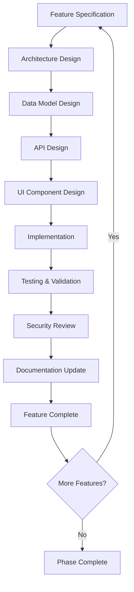

# Book 4: Feature Specifications

> **AI Development Manual → Feature Specifications**  
> *Detailed feature specifications and implementation guides for the Medical Dictation Service*

---

## 📍 Navigation Context

**Current Location**: `Documentation/AI-Development-Guide/04-Feature-Specifications/`  
**Parent**: [AI Development Guide](../README.md)  
**Purpose**: Define detailed feature specifications and implementation patterns

---

## 📖 Chapters in This Book

### **Chapter 1: Core Transcription Features** [`01-Core-Transcription/`](01-Core-Transcription/)
**Implementation Phases**: `0.2-01` to `0.2-04`  
- **Verse 1**: [Real-time Speech Recognition](01-Core-Transcription/speech-recognition.md)
- **Verse 2**: [Medical Terminology Processing](01-Core-Transcription/medical-terminology.md)
- **Verse 3**: [Audio Quality Management](01-Core-Transcription/audio-quality.md)
- **Verse 4**: [Transcription Accuracy Optimization](01-Core-Transcription/accuracy-optimization.md)

### **Chapter 2: Template Management System** [`02-Template-Management/`](02-Template-Management/)
**Implementation Phases**: `0.3-01` to `0.3-04`  
- **Verse 1**: [Template Data Models](02-Template-Management/template-models.md)
- **Verse 2**: [Template Editor Interface](02-Template-Management/template-editor.md)
- **Verse 3**: [Variable System Design](02-Template-Management/variable-system.md)
- **Verse 4**: [Template Library Organization](02-Template-Management/template-library.md)

### **Chapter 3: Patient Workflow Engine** [`03-Patient-Workflow/`](03-Patient-Workflow/)
**Implementation Phases**: `0.2-03`, `0.4-03` to `0.4-04`  
- **Verse 1**: [Patient Session Management](03-Patient-Workflow/session-management.md)
- **Verse 2**: [Context Switching Prevention](03-Patient-Workflow/context-prevention.md)
- **Verse 3**: [Session State Management](03-Patient-Workflow/state-management.md)
- **Verse 4**: [Workflow Validation](03-Patient-Workflow/workflow-validation.md)

### **Chapter 4: Real-time Audio Processing** [`04-Audio-Processing/`](04-Audio-Processing/)
**Implementation Phases**: `0.2-04`, `0.4-01` to `0.4-02`  
- **Verse 1**: [Audio Capture & Streaming](04-Audio-Processing/audio-capture.md)
- **Verse 2**: [Real-time Communication](04-Audio-Processing/realtime-communication.md)
- **Verse 3**: [Audio Device Management](04-Audio-Processing/device-management.md)
- **Verse 4**: [Audio Quality Processing](04-Audio-Processing/quality-processing.md)

### **Chapter 5: User Interface Components** [`05-UI-Components/`](05-UI-Components/)
**Implementation Phases**: `0.4-01` to `0.4-04`  
- **Verse 1**: [Main Transcription Interface](05-UI-Components/transcription-interface.md)
- **Verse 2**: [Patient Selection Components](05-UI-Components/patient-selection.md)
- **Verse 3**: [Template Selection Interface](05-UI-Components/template-selection.md)
- **Verse 4**: [Audio Control Components](05-UI-Components/audio-controls.md)

---

## 🎯 Feature Implementation Strategy

### **Feature Development Principles**
1. **Medical-First Design**: Every feature prioritizes clinical workflow needs
2. **HIPAA Compliance**: Security and privacy built into every component
3. **Real-time Performance**: Optimized for live transcription requirements
4. **User Experience**: Intuitive interfaces for healthcare providers
5. **Scalability**: Designed to grow with practice needs

### **Feature Development Flow**

---

## 🔄 Cross-Feature Integration

### **Feature Interaction Matrix**

| **Feature** | **Transcription** | **Templates** | **Patient Workflow** | **Audio Processing** | **UI Components** |
|-------------|-------------------|---------------|---------------------|---------------------|-------------------|
| **Core Transcription** | ■ | ⭐⭐⭐ | ⭐⭐⭐ | ⭐⭐⭐ | ⭐⭐⭐ |
| **Template Management** | ⭐⭐⭐ | ■ | ⭐⭐ | ⭐ | ⭐⭐⭐ |
| **Patient Workflow** | ⭐⭐⭐ | ⭐⭐ | ■ | ⭐⭐ | ⭐⭐⭐ |
| **Audio Processing** | ⭐⭐⭐ | ⭐ | ⭐⭐ | ■ | ⭐⭐⭐ |
| **UI Components** | ⭐⭐⭐ | ⭐⭐⭐ | ⭐⭐⭐ | ⭐⭐⭐ | ■ |

**Legend**: ■ Self | ⭐⭐⭐ High Integration | ⭐⭐ Medium Integration | ⭐ Low Integration

### **Integration Patterns**

#### **1. Transcription → Template Integration**
- Templates guide transcription structure
- Real-time variable population during speech
- SOAP section auto-categorization

#### **2. Patient Workflow → Security Integration**
- Patient context enforces data isolation
- Session boundaries prevent data mixing
- Audit trails track all patient data access

#### **3. Audio → Real-time Integration**
- SignalR streams for live transcription updates
- Audio quality feedback to user interface
- Device status monitoring and switching

---

## 📋 Feature Implementation Checklist

### **For Each Feature Implementation**

#### **📝 Specification Phase**
- [ ] Business requirements clearly defined
- [ ] User stories documented with acceptance criteria
- [ ] Technical specifications written
- [ ] Security requirements identified
- [ ] Integration points mapped

#### **🏗️ Design Phase**
- [ ] Data models designed and reviewed
- [ ] API endpoints specified
- [ ] UI wireframes created
- [ ] Component architecture defined
- [ ] Performance requirements established

#### **⚙️ Implementation Phase**
- [ ] Core functionality implemented
- [ ] Unit tests written (>80% coverage)
- [ ] Integration tests created
- [ ] Security features implemented
- [ ] Error handling completed

#### **🧪 Validation Phase**
- [ ] Feature testing completed
- [ ] Security review passed
- [ ] Performance benchmarks met
- [ ] User acceptance testing conducted
- [ ] Documentation updated

---

## 🎯 Feature Priority Matrix

### **Implementation Priority Ranking**

| **Feature** | **Business Value** | **Technical Complexity** | **Dependencies** | **Priority Score** |
|-------------|-------------------|-------------------------|------------------|-------------------|
| Patient Workflow | ⭐⭐⭐⭐⭐ | ⭐⭐ | Low | 🟢 Critical |
| Core Transcription | ⭐⭐⭐⭐⭐ | ⭐⭐⭐⭐ | Medium | 🟢 Critical |
| Audio Processing | ⭐⭐⭐⭐ | ⭐⭐⭐⭐ | High | 🟡 High |
| Template Management | ⭐⭐⭐⭐ | ⭐⭐⭐ | Medium | 🟡 High |
| UI Components | ⭐⭐⭐ | ⭐⭐⭐ | High | 🟠 Medium |

### **Implementation Sequence Rationale**
1. **Patient Workflow** - Foundation for all other features, ensures HIPAA compliance
2. **Core Transcription** - Primary business value, enables basic functionality
3. **Audio Processing** - Required for transcription quality and user experience
4. **Template Management** - Enhances transcription with structured output
5. **UI Components** - Polish and user experience optimization

---

## 🔒 Security Considerations by Feature

### **Feature-Specific Security Requirements**

#### **Core Transcription Security**
- [ ] Audio data encrypted during transmission
- [ ] Transcription text encrypted at rest
- [ ] No persistent audio storage
- [ ] Access logging for all transcription operations

#### **Template Management Security**
- [ ] Template access based on user roles
- [ ] Version control for template changes
- [ ] Audit trail for template modifications
- [ ] Secure template sharing mechanisms

#### **Patient Workflow Security**
- [ ] Patient data isolation enforcement
- [ ] Session timeout mechanisms
- [ ] Context switching prevention
- [ ] Comprehensive audit logging

#### **Audio Processing Security**
- [ ] Secure audio device access
- [ ] Real-time data encryption
- [ ] Device authorization validation
- [ ] Audio quality tampering detection

#### **UI Components Security**
- [ ] Input validation and sanitization
- [ ] CSRF protection implementation
- [ ] Session management security
- [ ] Screen lock integration

---

## 📊 Feature Success Metrics

### **Measurable Outcomes by Feature**

| **Feature** | **Primary Metric** | **Target** | **Measurement Method** |
|-------------|-------------------|------------|------------------------|
| **Core Transcription** | Accuracy Rate | >90% | Word Error Rate calculation |
| **Template Management** | Adoption Rate | >80% | Template usage analytics |
| **Patient Workflow** | Error Prevention | 100% | Zero cross-patient data incidents |
| **Audio Processing** | Quality Score | >85% | Audio recognition confidence |
| **UI Components** | User Satisfaction | >4.0/5 | User experience surveys |

### **Feature Performance Targets**

| **Feature** | **Response Time** | **Throughput** | **Availability** |
|-------------|------------------|----------------|------------------|
| **Core Transcription** | <2s latency | 50+ concurrent users | 99.9% |
| **Template Management** | <500ms | 100+ templates/user | 99.5% |
| **Patient Workflow** | <200ms | 200+ sessions/hour | 99.9% |
| **Audio Processing** | <100ms | Real-time streaming | 99.9% |
| **UI Components** | <200ms | 50+ concurrent UI | 99.5% |

---

## 🔗 Cross-References

| **Feature Area** | **Reference** | **Context** |
|------------------|---------------|-------------|
| Business Requirements | [Vision:Business:Requirements](../01-Project-Overview/01-Project-Vision/business-requirements.md) | Feature justification |
| Technical Requirements | [Vision:Technical:Requirements](../01-Project-Overview/01-Project-Vision/technical-requirements.md) | Performance specifications |
| Architecture Design | [Architecture:System:Overview](../02-Architecture-Design/01-System-Architecture/) | System integration |
| Implementation Phases | [Implementation:Phases:Overview](../03-Implementation-Phases/) | Development timeline |

---

## 🚨 Feature Implementation Guidelines

### **For AI Assistants**
- **Start with specifications** before writing any code
- **Validate integration points** with existing features
- **Implement security first** - never defer security considerations
- **Test thoroughly** - each feature must meet quality standards
- **Update documentation** immediately after implementation

### **For Human Developers**
- Each feature should be independently testable
- Security requirements are non-negotiable
- Performance targets must be validated before feature completion
- User experience should be validated with healthcare providers
- Integration testing is as important as unit testing

---

**Next Steps**: 
- **Core transcription details?** → See [Core Transcription Features](01-Core-Transcription/)
- **Template system design?** → Review [Template Management System](02-Template-Management/)
- **Patient workflow specifics?** → Go to [Patient Workflow Engine](03-Patient-Workflow/)
- **Implementation ready?** → Start with [Implementation Phases](../03-Implementation-Phases/)

---

> **Feature Specifications Principle**: *"Every feature must serve the ultimate goal of improving healthcare provider efficiency while maintaining absolute security and clinical accuracy standards."* 