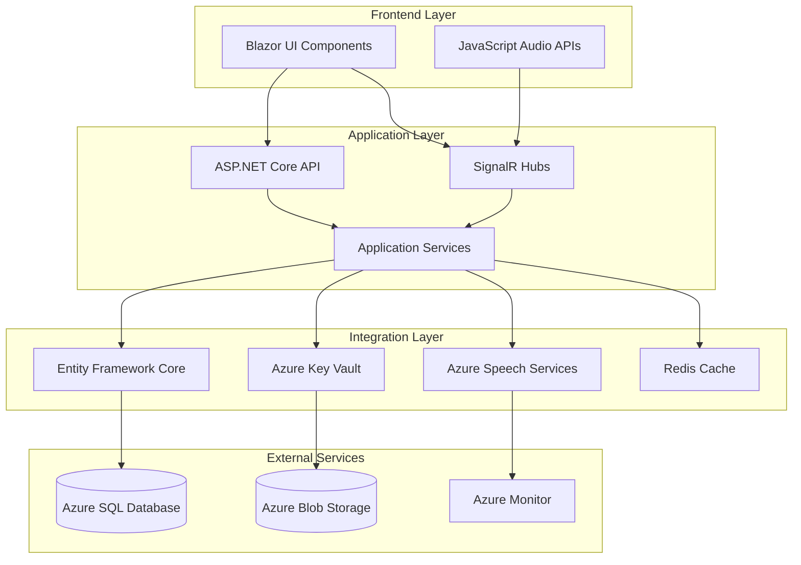
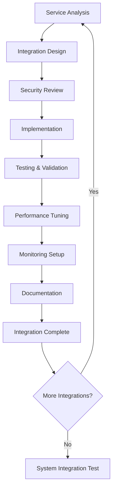

# Book 5: Integration Patterns

> **AI Development Manual → Integration Patterns**  
> *Comprehensive integration guides for third-party services and internal component communication*

---

## 📍 Navigation Context

**Current Location**: `Documentation/AI-Development-Guide/05-Integration-Patterns/`  
**Parent**: [AI Development Guide](../README.md)  
**Purpose**: Define integration patterns, service connections, and API implementations

---

## 📖 Chapters in This Book

### **Chapter 1: Azure Services Integration** [`01-Azure-Services/`](01-Azure-Services/)
**Implementation Phases**: `0.2-01` to `0.5-04`  
- **Verse 1**: [Azure Speech Services](01-Azure-Services/azure-speech.md)
- **Verse 2**: [Azure SQL Database](01-Azure-Services/azure-sql.md)
- **Verse 3**: [Azure App Service](01-Azure-Services/azure-app-service.md)
- **Verse 4**: [Azure Key Vault](01-Azure-Services/azure-key-vault.md)

### **Chapter 2: Real-time Communication** [`02-Realtime-Communication/`](02-Realtime-Communication/)
**Implementation Phases**: `0.2-04`, `0.4-01` to `0.4-02`  
- **Verse 1**: [SignalR Implementation](02-Realtime-Communication/signalr-implementation.md)
- **Verse 2**: [WebSocket Management](02-Realtime-Communication/websocket-management.md)
- **Verse 3**: [Connection Scaling](02-Realtime-Communication/connection-scaling.md)
- **Verse 4**: [Real-time Security](02-Realtime-Communication/realtime-security.md)

### **Chapter 3: Data Access Patterns** [`03-Data-Access/`](03-Data-Access/)
**Implementation Phases**: `0.2-02` to `0.2-03`  
- **Verse 1**: [Entity Framework Core](03-Data-Access/entity-framework.md)
- **Verse 2**: [Repository Pattern](03-Data-Access/repository-pattern.md)
- **Verse 3**: [CQRS Implementation](03-Data-Access/cqrs-pattern.md)
- **Verse 4**: [Data Caching Strategies](03-Data-Access/caching-strategies.md)

### **Chapter 4: External Service Integration** [`04-External-Services/`](04-External-Services/)
**Implementation Phases**: `0.3-03` to `0.4-04`  
- **Verse 1**: [HTTP Client Configuration](04-External-Services/http-client.md)
- **Verse 2**: [API Rate Limiting](04-External-Services/rate-limiting.md)
- **Verse 3**: [Service Health Monitoring](04-External-Services/health-monitoring.md)
- **Verse 4**: [Circuit Breaker Pattern](04-External-Services/circuit-breaker.md)

### **Chapter 5: Security Integration** [`05-Security-Integration/`](05-Security-Integration/)
**Implementation Phases**: `0.1-02` to `0.5-04`  
- **Verse 1**: [Authentication Providers](05-Security-Integration/authentication.md)
- **Verse 2**: [Authorization Policies](05-Security-Integration/authorization.md)
- **Verse 3**: [Audit Logging Integration](05-Security-Integration/audit-logging.md)
- **Verse 4**: [HIPAA Compliance Patterns](05-Security-Integration/hipaa-patterns.md)

---

## 🔄 Integration Architecture Overview

### **System Integration Map**


---

## 🔧 Integration Principles

### **Core Integration Standards**
1. **Resilience First**: All integrations must handle failures gracefully
2. **Security by Design**: Authentication and encryption for all external calls
3. **Observability**: Comprehensive logging and monitoring for all integrations
4. **Performance Optimization**: Efficient patterns for real-time requirements
5. **HIPAA Compliance**: All integrations must meet healthcare data standards

### **Integration Development Flow**


---

## 🏗️ Integration Patterns Library

### **Common Integration Patterns**

#### **1. Service Facade Pattern**
```csharp
public interface IAzureSpeechFacade
{
    Task<TranscriptionResult> TranscribeAsync(AudioStream audio, CancellationToken cancellationToken);
    Task<bool> IsServiceHealthyAsync();
    Task<ServiceMetrics> GetServiceMetricsAsync();
}

public class AzureSpeechFacade : IAzureSpeechFacade
{
    private readonly SpeechConfig _speechConfig;
    private readonly ILogger<AzureSpeechFacade> _logger;
    private readonly ICircuitBreaker _circuitBreaker;
    
    public async Task<TranscriptionResult> TranscribeAsync(AudioStream audio, CancellationToken cancellationToken)
    {
        return await _circuitBreaker.ExecuteAsync(async () =>
        {
            using var recognizer = new SpeechRecognizer(_speechConfig);
            var result = await recognizer.RecognizeOnceAsync();
            
            _logger.LogInformation("Transcription completed with confidence: {Confidence}", result.Properties);
            
            return new TranscriptionResult
            {
                Text = result.Text,
                Confidence = ExtractConfidence(result),
                Duration = result.Duration
            };
        });
    }
}
```

#### **2. Repository with Unit of Work**
```csharp
public interface IUnitOfWork : IDisposable
{
    IPatientRepository Patients { get; }
    ITranscriptionRepository Transcriptions { get; }
    ITemplateRepository Templates { get; }
    
    Task<int> SaveChangesAsync(CancellationToken cancellationToken = default);
    Task BeginTransactionAsync();
    Task CommitTransactionAsync();
    Task RollbackTransactionAsync();
}

public class UnitOfWork : IUnitOfWork
{
    private readonly ApplicationDbContext _context;
    private IDbContextTransaction? _transaction;
    
    public IPatientRepository Patients { get; }
    public ITranscriptionRepository Transcriptions { get; }
    public ITemplateRepository Templates { get; }
    
    public async Task<int> SaveChangesAsync(CancellationToken cancellationToken = default)
    {
        try
        {
            var result = await _context.SaveChangesAsync(cancellationToken);
            _logger.LogInformation("Saved {Count} changes to database", result);
            return result;
        }
        catch (Exception ex)
        {
            _logger.LogError(ex, "Failed to save changes to database");
            throw;
        }
    }
}
```

#### **3. Event-Driven Integration**
```csharp
public class TranscriptionEventHandler : INotificationHandler<TranscriptionCompletedEvent>
{
    private readonly ITemplateProcessor _templateProcessor;
    private readonly IPatientContextService _patientContext;
    private readonly IAuditLogger _auditLogger;
    
    public async Task Handle(TranscriptionCompletedEvent notification, CancellationToken cancellationToken)
    {
        // Update patient context
        await _patientContext.UpdateTranscriptionAsync(
            notification.PatientId, 
            notification.TranscriptionId
        );
        
        // Process with templates if applicable
        if (notification.TemplateId.HasValue)
        {
            await _templateProcessor.PopulateTemplateAsync(
                notification.TemplateId.Value,
                notification.TranscriptionText
            );
        }
        
        // Log audit event
        await _auditLogger.LogTranscriptionEventAsync(new AuditEvent
        {
            EventType = "TranscriptionCompleted",
            PatientId = notification.PatientId,
            UserId = notification.UserId,
            Details = $"Transcription {notification.TranscriptionId} completed"
        });
    }
}
```

---

## 📊 Integration Performance Targets

### **Service Integration SLAs**

| **Integration** | **Response Time** | **Availability** | **Error Rate** | **Throughput** |
|----------------|------------------|------------------|----------------|----------------|
| **Azure Speech Services** | <2s | 99.9% | <1% | 50+ concurrent |
| **Azure SQL Database** | <500ms | 99.95% | <0.1% | 200+ TPS |
| **SignalR Connections** | <100ms | 99.9% | <0.5% | 100+ concurrent |
| **Azure Key Vault** | <300ms | 99.9% | <0.1% | 50+ requests/min |
| **External APIs** | <1s | 99.5% | <2% | Variable |

### **Integration Monitoring Metrics**

| **Metric Category** | **Key Indicators** | **Alert Thresholds** |
|--------------------|-------------------|---------------------|
| **Performance** | Response times, throughput | >SLA targets |
| **Reliability** | Error rates, availability | >1% error rate |
| **Security** | Authentication failures, unauthorized access | >0.1% failure rate |
| **Business** | Transaction success, user satisfaction | <95% success rate |

---

## 🔒 Security Integration Standards

### **Authentication Integration**
```csharp
public class AuthenticationIntegration
{
    public void ConfigureAuthentication(IServiceCollection services, IConfiguration configuration)
    {
        services.AddAuthentication(JwtBearerDefaults.AuthenticationScheme)
            .AddJwtBearer(options =>
            {
                options.Authority = configuration["AzureAd:Authority"];
                options.Audience = configuration["AzureAd:Audience"];
                options.RequireHttpsMetadata = true;
                
                options.Events = new JwtBearerEvents
                {
                    OnAuthenticationFailed = context =>
                    {
                        _logger.LogWarning("Authentication failed: {Error}", context.Exception.Message);
                        return Task.CompletedTask;
                    },
                    OnTokenValidated = context =>
                    {
                        _auditLogger.LogUserAuthentication(context.Principal);
                        return Task.CompletedTask;
                    }
                };
            });
    }
}
```

### **Encryption in Transit**
```csharp
public class SecureHttpClientFactory
{
    public HttpClient CreateSecureClient(string baseUrl)
    {
        var handler = new HttpClientHandler()
        {
            SslProtocols = SslProtocols.Tls13 | SslProtocols.Tls12,
            CheckCertificateRevocationList = true
        };
        
        var client = new HttpClient(handler)
        {
            BaseAddress = new Uri(baseUrl),
            Timeout = TimeSpan.FromSeconds(30)
        };
        
        client.DefaultRequestHeaders.Add("User-Agent", "MedicalDictationService/1.0");
        client.DefaultRequestHeaders.Add("X-Request-ID", Guid.NewGuid().ToString());
        
        return client;
    }
}
```

---

## 🧪 Integration Testing Patterns

### **Integration Test Structure**
```csharp
[Collection("Integration")]
public class AzureSpeechIntegrationTests : IClassFixture<WebApplicationFactory<Program>>
{
    private readonly WebApplicationFactory<Program> _factory;
    private readonly ITestOutputHelper _output;
    
    [Fact]
    public async Task TranscribeAudio_WithValidInput_ReturnsAccurateTranscription()
    {
        // Arrange
        var client = _factory.CreateClient();
        var audioData = LoadTestAudioFile("sample-medical-dictation.wav");
        
        // Act
        var response = await client.PostAsync("/api/transcription/stream", 
            new ByteArrayContent(audioData));
        
        // Assert
        response.EnsureSuccessStatusCode();
        var result = await response.Content.ReadFromJsonAsync<TranscriptionResult>();
        
        Assert.NotNull(result);
        Assert.True(result.Confidence > 0.85);
        Assert.Contains("patient", result.Text.ToLower());
    }
    
    [Fact]
    public async Task DatabaseIntegration_WithPatientData_MaintainsDataIntegrity()
    {
        // Arrange
        using var scope = _factory.Services.CreateScope();
        var context = scope.ServiceProvider.GetRequiredService<ApplicationDbContext>();
        var patient = CreateTestPatient();
        
        // Act
        context.Patients.Add(patient);
        await context.SaveChangesAsync();
        
        // Assert
        var savedPatient = await context.Patients.FindAsync(patient.Id);
        Assert.NotNull(savedPatient);
        Assert.Equal(patient.MedicalRecordNumber, savedPatient.MedicalRecordNumber);
    }
}
```

### **Health Check Integration**
```csharp
public class IntegrationHealthChecks
{
    public static void ConfigureHealthChecks(IServiceCollection services, IConfiguration configuration)
    {
        services.AddHealthChecks()
            .AddSqlServer(
                connectionString: configuration.GetConnectionString("DefaultConnection"),
                healthQuery: "SELECT 1",
                name: "database",
                timeout: TimeSpan.FromSeconds(5))
            .AddUrlGroup(
                uri: new Uri(configuration["AzureSpeech:Endpoint"]),
                name: "azure-speech",
                timeout: TimeSpan.FromSeconds(10))
            .AddSignalRHub(
                hubUrl: "/transcriptionhub",
                name: "signalr-hub")
            .AddRedis(
                connectionString: configuration.GetConnectionString("Redis"),
                name: "redis-cache");
    }
}
```

---

## 📋 Integration Implementation Checklist

### **For Each Integration**

#### **📝 Design Phase**
- [ ] Service requirements documented
- [ ] Integration pattern selected
- [ ] Security requirements identified
- [ ] Performance targets established
- [ ] Error handling strategy defined

#### **🔧 Implementation Phase**
- [ ] Service facade implemented
- [ ] Error handling and retry logic added
- [ ] Security measures implemented
- [ ] Logging and monitoring configured
- [ ] Circuit breaker pattern applied

#### **🧪 Testing Phase**
- [ ] Unit tests for integration layer
- [ ] Integration tests with real services
- [ ] Performance benchmarks validated
- [ ] Security testing completed
- [ ] Failure scenario testing done

#### **📊 Monitoring Phase**
- [ ] Health checks configured
- [ ] Metrics collection implemented
- [ ] Alerting rules established
- [ ] Dashboard created
- [ ] SLA monitoring active

---

## 🔗 Cross-References

| **Integration Area** | **Reference** | **Context** |
|---------------------|---------------|-------------|
| Feature Requirements | [Features:Overview](../04-Feature-Specifications/) | Integration needs |
| Architecture Design | [Architecture:Components](../02-Architecture-Design/) | System integration |
| Security Patterns | [Features:Security:Integration](../04-Feature-Specifications/#security-considerations-by-feature) | Security implementation |
| Implementation Phases | [Implementation:Phases](../03-Implementation-Phases/) | Development timeline |

---

## 🚨 Integration Guidelines

### **For AI Assistants**
- **Security first** - implement authentication and encryption before functionality
- **Test thoroughly** - integration bugs are harder to debug in production
- **Monitor everything** - add comprehensive logging and metrics
- **Handle failures** - implement retry logic and circuit breakers
- **Document patterns** - update this guide with new integration patterns

### **For Human Developers**
- Start with health checks and monitoring
- Use dependency injection for all integrations
- Implement proper connection pooling and resource management
- Always use configuration for service endpoints and secrets
- Write integration tests that can run in CI/CD

---

**Next Steps**: 
- **Azure services integration?** → See [Azure Services Integration](01-Azure-Services/)
- **Real-time communication?** → Review [Real-time Communication](02-Realtime-Communication/)
- **Data access patterns?** → Go to [Data Access Patterns](03-Data-Access/)
- **Ready to implement?** → Start with [Implementation Phases](../03-Implementation-Phases/)

---

> **Integration Principle**: *"Robust integrations are the backbone of reliable healthcare systems - they must be secure, resilient, and observable."* 