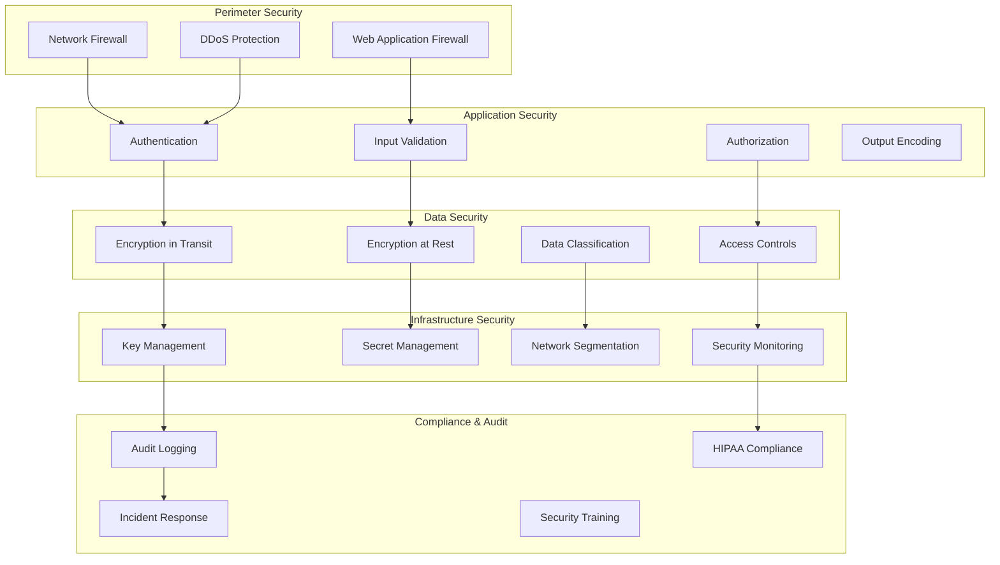
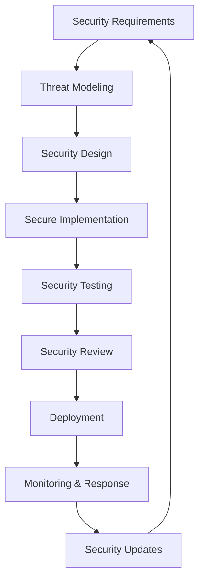

# Book 6: Security Framework

> **AI Development Manual → Security Framework**  
> *HIPAA-compliant security patterns, implementation guides, and audit requirements for healthcare applications*

---

## 📍 Navigation Context

**Current Location**: `Documentation/AI-Development-Guide/06-Security-Framework/`  
**Parent**: [AI Development Guide](../README.md)  
**Purpose**: Define comprehensive security framework for HIPAA compliance and healthcare data protection

---

## 📖 Chapters in This Book

### **Chapter 1: HIPAA Compliance Framework** [`01-HIPAA-Compliance/`](01-HIPAA-Compliance/)
**Implementation Phases**: `0.1-02` to `0.5-04`  
- **Verse 1**: [Administrative Safeguards](01-HIPAA-Compliance/administrative-safeguards.md)
- **Verse 2**: [Physical Safeguards](01-HIPAA-Compliance/physical-safeguards.md)
- **Verse 3**: [Technical Safeguards](01-HIPAA-Compliance/technical-safeguards.md)
- **Verse 4**: [Compliance Monitoring](01-HIPAA-Compliance/compliance-monitoring.md)

### **Chapter 2: Authentication & Authorization** [`02-Auth-Framework/`](02-Auth-Framework/)
**Implementation Phases**: `0.1-02` to `0.2-01`  
- **Verse 1**: [Multi-Factor Authentication](02-Auth-Framework/multi-factor-auth.md)
- **Verse 2**: [Role-Based Access Control](02-Auth-Framework/rbac-implementation.md)
- **Verse 3**: [Session Management](02-Auth-Framework/session-management.md)
- **Verse 4**: [Password Policies](02-Auth-Framework/password-policies.md)

### **Chapter 3: Data Protection** [`03-Data-Protection/`](03-Data-Protection/)
**Implementation Phases**: `0.2-02` to `0.5-03`  
- **Verse 1**: [Encryption at Rest](03-Data-Protection/encryption-at-rest.md)
- **Verse 2**: [Encryption in Transit](03-Data-Protection/encryption-in-transit.md)
- **Verse 3**: [Data Classification](03-Data-Protection/data-classification.md)
- **Verse 4**: [Data Loss Prevention](03-Data-Protection/data-loss-prevention.md)

### **Chapter 4: Audit & Logging** [`04-Audit-Logging/`](04-Audit-Logging/)
**Implementation Phases**: `0.1-03` to `0.5-04`  
- **Verse 1**: [Audit Trail Requirements](04-Audit-Logging/audit-requirements.md)
- **Verse 2**: [Logging Implementation](04-Audit-Logging/logging-implementation.md)
- **Verse 3**: [Security Event Monitoring](04-Audit-Logging/security-monitoring.md)
- **Verse 4**: [Incident Response](04-Audit-Logging/incident-response.md)

### **Chapter 5: Application Security** [`05-Application-Security/`](05-Application-Security/)
**Implementation Phases**: `0.2-01` to `0.5-04`  
- **Verse 1**: [Input Validation](05-Application-Security/input-validation.md)
- **Verse 2**: [Output Encoding](05-Application-Security/output-encoding.md)
- **Verse 3**: [SQL Injection Prevention](05-Application-Security/sql-injection-prevention.md)
- **Verse 4**: [Cross-Site Scripting Prevention](05-Application-Security/xss-prevention.md)

---

## 🛡️ Security Architecture Overview

### **Defense in Depth Strategy**


---

## 🔒 Core Security Principles

### **Healthcare Security Standards**
1. **Patient Data Privacy**: Absolute protection of PHI (Protected Health Information)
2. **Access Control**: Least privilege access with role-based permissions
3. **Audit Trail**: Complete logging of all data access and modifications
4. **Data Integrity**: Prevention of unauthorized data modification
5. **Availability**: Ensuring healthcare systems remain accessible when needed

### **Security Implementation Lifecycle**


---

## 🏥 HIPAA Compliance Requirements

### **Administrative Safeguards Implementation**

#### **Security Officer Assignment**
```csharp
public class SecurityOfficerService
{
    private readonly IAuditLogger _auditLogger;
    private readonly IUserService _userService;
    
    public async Task AssignSecurityOfficer(string userId, SecurityOfficerRole role)
    {
        var user = await _userService.GetUserByIdAsync(userId);
        
        // Verify user qualifications
        if (!await VerifySecurityOfficerQualifications(user))
        {
            throw new SecurityException("User does not meet security officer qualifications");
        }
        
        // Assign role with audit trail
        await _userService.AssignRoleAsync(userId, role.ToString());
        
        await _auditLogger.LogSecurityEventAsync(new SecurityEvent
        {
            EventType = "SecurityOfficerAssigned",
            UserId = userId,
            Details = $"User assigned as {role}",
            Timestamp = DateTime.UtcNow,
            IpAddress = GetCurrentUserIpAddress()
        });
    }
}
```

#### **Workforce Training Management**
```csharp
public class WorkforceTrainingService
{
    public async Task<TrainingStatus> GetUserTrainingStatus(string userId)
    {
        var completedTraining = await GetCompletedTrainingAsync(userId);
        var requiredTraining = await GetRequiredTrainingAsync();
        
        return new TrainingStatus
        {
            UserId = userId,
            CompletedModules = completedTraining,
            RequiredModules = requiredTraining,
            ComplianceStatus = CalculateComplianceStatus(completedTraining, requiredTraining),
            NextRenewalDate = CalculateNextRenewalDate(completedTraining)
        };
    }
    
    [RequiredTrainingModule("HIPAA-Basics")]
    [RequiredTrainingModule("PHI-Handling")]
    [RequiredTrainingModule("IncidentResponse")]
    public async Task RequireTrainingCompletion(string userId)
    {
        var status = await GetUserTrainingStatus(userId);
        
        if (status.ComplianceStatus != ComplianceStatus.Compliant)
        {
            throw new TrainingRequiredException(
                $"User {userId} must complete required training modules");
        }
    }
}
```

### **Technical Safeguards Implementation**

#### **Access Control Systems**
```csharp
[AttributeUsage(AttributeTargets.Method | AttributeTargets.Class)]
public class RequirePatientAccessAttribute : Attribute, IAuthorizationRequirement
{
    public string Permission { get; }
    
    public RequirePatientAccessAttribute(string permission)
    {
        Permission = permission;
    }
}

public class PatientAccessHandler : AuthorizationHandler<RequirePatientAccessAttribute>
{
    private readonly IPatientContextService _patientContext;
    private readonly IAuditLogger _auditLogger;
    
    protected override async Task HandleRequirementAsync(
        AuthorizationHandlerContext context,
        RequirePatientAccessAttribute requirement)
    {
        var user = context.User;
        var patientId = GetPatientIdFromRequest(context);
        
        // Verify user has access to this specific patient
        var hasAccess = await _patientContext.UserHasPatientAccessAsync(
            user.GetUserId(), 
            patientId, 
            requirement.Permission);
        
        if (hasAccess)
        {
            context.Succeed(requirement);
            
            // Log successful access
            await _auditLogger.LogPatientAccessAsync(new PatientAccessEvent
            {
                UserId = user.GetUserId(),
                PatientId = patientId,
                Permission = requirement.Permission,
                AccessGranted = true,
                Timestamp = DateTime.UtcNow
            });
        }
        else
        {
            // Log failed access attempt
            await _auditLogger.LogPatientAccessAsync(new PatientAccessEvent
            {
                UserId = user.GetUserId(),
                PatientId = patientId,
                Permission = requirement.Permission,
                AccessGranted = false,
                Timestamp = DateTime.UtcNow,
                FailureReason = "Insufficient permissions"
            });
        }
    }
}
```

#### **Audit Controls Implementation**
```csharp
public class HIPAAAuditLogger : IAuditLogger
{
    private readonly ILogger<HIPAAAuditLogger> _logger;
    private readonly ApplicationDbContext _context;
    
    public async Task LogPatientDataAccessAsync(PatientDataAccessEvent auditEvent)
    {
        var auditRecord = new AuditRecord
        {
            Id = Guid.NewGuid(),
            EventType = "PatientDataAccess",
            UserId = auditEvent.UserId,
            PatientId = auditEvent.PatientId,
            DataType = auditEvent.DataType,
            Action = auditEvent.Action,
            Timestamp = DateTime.UtcNow,
            IpAddress = auditEvent.IpAddress,
            UserAgent = auditEvent.UserAgent,
            Details = JsonSerializer.Serialize(auditEvent.Details),
            Success = auditEvent.Success
        };
        
        _context.AuditRecords.Add(auditRecord);
        await _context.SaveChangesAsync();
        
        // Also log to structured logging for real-time monitoring
        _logger.LogInformation(
            "Patient data access: User {UserId} accessed {DataType} for Patient {PatientId} - {Action}",
            auditEvent.UserId,
            auditEvent.DataType,
            auditEvent.PatientId,
            auditEvent.Action
        );
        
        // Send to security monitoring system
        await SendToSecurityMonitoring(auditRecord);
    }
}
```

---

## 🔐 Data Encryption Implementation

### **Encryption at Rest**
```csharp
public class EncryptionService
{
    private readonly IKeyVaultService _keyVault;
    private readonly ILogger<EncryptionService> _logger;
    
    public async Task<string> EncryptSensitiveDataAsync(string plainText, string keyName)
    {
        try
        {
            var key = await _keyVault.GetKeyAsync(keyName);
            
            using var aes = Aes.Create();
            aes.KeySize = 256;
            aes.Mode = CipherMode.GCM;
            aes.Key = key.Value;
            
            var iv = new byte[12]; // GCM recommended IV size
            RandomNumberGenerator.Fill(iv);
            aes.IV = iv;
            
            using var encryptor = aes.CreateEncryptor();
            var plainBytes = Encoding.UTF8.GetBytes(plainText);
            var encryptedBytes = encryptor.TransformFinalBlock(plainBytes, 0, plainBytes.Length);
            
            // Combine IV + encrypted data + authentication tag
            var result = new byte[iv.Length + encryptedBytes.Length];
            Buffer.BlockCopy(iv, 0, result, 0, iv.Length);
            Buffer.BlockCopy(encryptedBytes, 0, result, iv.Length, encryptedBytes.Length);
            
            return Convert.ToBase64String(result);
        }
        catch (Exception ex)
        {
            _logger.LogError(ex, "Failed to encrypt sensitive data");
            throw new SecurityException("Encryption failed", ex);
        }
    }
    
    public async Task<string> DecryptSensitiveDataAsync(string encryptedData, string keyName)
    {
        try
        {
            var key = await _keyVault.GetKeyAsync(keyName);
            var encryptedBytes = Convert.FromBase64String(encryptedData);
            
            using var aes = Aes.Create();
            aes.KeySize = 256;
            aes.Mode = CipherMode.GCM;
            aes.Key = key.Value;
            
            // Extract IV from the beginning
            var iv = new byte[12];
            Buffer.BlockCopy(encryptedBytes, 0, iv, 0, iv.Length);
            aes.IV = iv;
            
            // Extract encrypted data
            var cipherText = new byte[encryptedBytes.Length - iv.Length];
            Buffer.BlockCopy(encryptedBytes, iv.Length, cipherText, 0, cipherText.Length);
            
            using var decryptor = aes.CreateDecryptor();
            var decryptedBytes = decryptor.TransformFinalBlock(cipherText, 0, cipherText.Length);
            
            return Encoding.UTF8.GetString(decryptedBytes);
        }
        catch (Exception ex)
        {
            _logger.LogError(ex, "Failed to decrypt sensitive data");
            throw new SecurityException("Decryption failed", ex);
        }
    }
}
```

### **Database Column Encryption**
```csharp
[EntityTypeConfiguration(typeof(Patient))]
public class PatientConfiguration : IEntityTypeConfiguration<Patient>
{
    public void Configure(EntityTypeBuilder<Patient> builder)
    {
        builder.ToTable("Patients");
        
        // Encrypt PHI fields
        builder.Property(p => p.SocialSecurityNumber)
            .HasConversion(
                v => EncryptionHelper.Encrypt(v),
                v => EncryptionHelper.Decrypt(v))
            .HasColumnType("nvarchar(500)");
            
        builder.Property(p => p.DateOfBirth)
            .HasConversion(
                v => EncryptionHelper.Encrypt(v.ToString()),
                v => DateTime.Parse(EncryptionHelper.Decrypt(v)))
            .HasColumnType("nvarchar(500)");
            
        // Hash PII for searching while keeping original encrypted
        builder.Property(p => p.LastNameHash)
            .HasComputedColumnSql("HASHBYTES('SHA2_256', LastName)")
            .HasColumnType("varbinary(32)");
    }
}
```

---

## 🔍 Security Monitoring & Incident Response

### **Real-time Security Monitoring**
```csharp
public class SecurityMonitoringService
{
    private readonly ILogger<SecurityMonitoringService> _logger;
    private readonly IHubContext<SecurityHub> _securityHub;
    
    public async Task MonitorSecurityEvents()
    {
        // Monitor for suspicious activities
        await MonitorFailedLoginAttempts();
        await MonitorUnauthorizedDataAccess();
        await MonitorDataExfiltration();
        await MonitorSystemAnomalies();
    }
    
    private async Task MonitorFailedLoginAttempts()
    {
        var recentFailures = await GetRecentFailedLogins(TimeSpan.FromMinutes(15));
        
        foreach (var userGroup in recentFailures.GroupBy(f => f.UserId))
        {
            if (userGroup.Count() >= 5)
            {
                await TriggerSecurityAlert(new SecurityAlert
                {
                    Type = SecurityAlertType.BruteForceAttempt,
                    Severity = AlertSeverity.High,
                    UserId = userGroup.Key,
                    Details = $"User {userGroup.Key} has {userGroup.Count()} failed login attempts in 15 minutes",
                    RecommendedAction = "Lock account and require security verification"
                });
            }
        }
    }
    
    private async Task TriggerSecurityAlert(SecurityAlert alert)
    {
        // Log the alert
        _logger.LogWarning("Security Alert: {Type} - {Details}", alert.Type, alert.Details);
        
        // Send to security team via SignalR
        await _securityHub.Clients.Group("SecurityTeam").SendAsync("SecurityAlert", alert);
        
        // Auto-response based on severity
        if (alert.Severity == AlertSeverity.Critical)
        {
            await ExecuteAutomaticResponse(alert);
        }
        
        // Store for investigation
        await StoreSecurityAlert(alert);
    }
}
```

### **Incident Response Automation**
```csharp
public class IncidentResponseService
{
    public async Task HandleSecurityIncident(SecurityIncident incident)
    {
        // Step 1: Immediate containment
        await ContainThreat(incident);
        
        // Step 2: Evidence preservation
        await PreserveEvidence(incident);
        
        // Step 3: Impact assessment
        var impact = await AssessImpact(incident);
        
        // Step 4: Notification
        await NotifyStakeholders(incident, impact);
        
        // Step 5: Recovery
        await InitiateRecovery(incident);
        
        // Step 6: Lessons learned
        await DocumentLessonsLearned(incident);
    }
    
    private async Task ContainThreat(SecurityIncident incident)
    {
        switch (incident.Type)
        {
            case IncidentType.UnauthorizedAccess:
                await LockAffectedAccounts(incident.AffectedUsers);
                await InvalidateActiveSessions(incident.AffectedUsers);
                break;
                
            case IncidentType.DataBreach:
                await QuarantineAffectedData(incident.AffectedData);
                await DisableDataAccess(incident.AffectedSystems);
                break;
                
            case IncidentType.MalwareDetection:
                await IsolateAffectedSystems(incident.AffectedSystems);
                await RunFullSystemScan();
                break;
        }
    }
}
```

---

## 📊 Security Metrics & KPIs

### **Security Performance Indicators**

| **Security Metric** | **Target** | **Alert Threshold** | **Measurement Frequency** |
|---------------------|------------|---------------------|--------------------------|
| **Authentication Success Rate** | >99.5% | <98% | Real-time |
| **Failed Login Attempts** | <5 per user/day | >10 per user/hour | Real-time |
| **Unauthorized Access Attempts** | 0 | >0 | Real-time |
| **Data Encryption Coverage** | 100% PHI | <100% | Daily |
| **Security Patch Level** | 100% current | <95% | Weekly |
| **Incident Response Time** | <30 minutes | >60 minutes | Per incident |

### **HIPAA Compliance Scorecard**
```csharp
public class HIPAAComplianceScorecard
{
    public async Task<ComplianceScore> CalculateComplianceScore()
    {
        var score = new ComplianceScore();
        
        // Administrative Safeguards (25%)
        score.AdministrativeScore = await CalculateAdministrativeCompliance();
        
        // Physical Safeguards (25%)
        score.PhysicalScore = await CalculatePhysicalCompliance();
        
        // Technical Safeguards (50%)
        score.TechnicalScore = await CalculateTechnicalCompliance();
        
        score.OverallScore = (score.AdministrativeScore * 0.25) + 
                           (score.PhysicalScore * 0.25) + 
                           (score.TechnicalScore * 0.50);
        
        score.ComplianceLevel = DetermineComplianceLevel(score.OverallScore);
        
        return score;
    }
    
    private ComplianceLevel DetermineComplianceLevel(double score)
    {
        return score switch
        {
            >= 95.0 => ComplianceLevel.FullyCompliant,
            >= 85.0 => ComplianceLevel.MostlyCompliant,
            >= 70.0 => ComplianceLevel.PartiallyCompliant,
            _ => ComplianceLevel.NonCompliant
        };
    }
}
```

---

## ✅ Security Implementation Checklist

### **Phase-by-Phase Security Requirements**

#### **Phase 0.1: Foundation Security**
- [ ] Multi-factor authentication implemented
- [ ] Role-based access control configured
- [ ] Basic audit logging in place
- [ ] Password policies enforced
- [ ] Session management secure

#### **Phase 0.2: Data Protection**
- [ ] Database encryption at rest enabled
- [ ] API communication encrypted (TLS 1.3)
- [ ] PHI fields properly encrypted
- [ ] Key management system configured
- [ ] Data classification implemented

#### **Phase 0.3: Application Security**
- [ ] Input validation on all endpoints
- [ ] Output encoding preventing XSS
- [ ] SQL injection prevention verified
- [ ] CSRF protection implemented
- [ ] Security headers configured

#### **Phase 0.4: Monitoring & Response**
- [ ] Security event monitoring active
- [ ] Incident response procedures tested
- [ ] Threat detection automated
- [ ] Security alerts configured
- [ ] Compliance reporting automated

#### **Phase 0.5: Production Security**
- [ ] Penetration testing completed
- [ ] Security audit passed
- [ ] HIPAA compliance verified
- [ ] Disaster recovery tested
- [ ] Security training completed

---

## 🔗 Cross-References

| **Security Area** | **Reference** | **Context** |
|------------------|---------------|-------------|
| HIPAA Requirements | [Vision:HIPAA:Scope](../01-Project-Overview/01-Project-Vision/hipaa-scope.md) | Compliance requirements |
| Integration Security | [Integration:Security](../05-Integration-Patterns/05-Security-Integration/) | Service security |
| Feature Security | [Features:Security](../04-Feature-Specifications/#security-considerations-by-feature) | Feature-specific security |
| Implementation Security | [Implementation:Security](../03-Implementation-Phases/) | Phase-specific security |

---

**Next Steps**: 
- **HIPAA compliance details?** → See [HIPAA Compliance Framework](01-HIPAA-Compliance/)
- **Authentication setup?** → Review [Authentication & Authorization](02-Auth-Framework/)
- **Data protection?** → Go to [Data Protection](03-Data-Protection/)
- **Ready to implement security?** → Start with [Implementation Phases](../03-Implementation-Phases/)

---

> **Security Framework Principle**: *"In healthcare technology, security is not a feature to be added later - it is the foundation upon which all other capabilities are built."* 